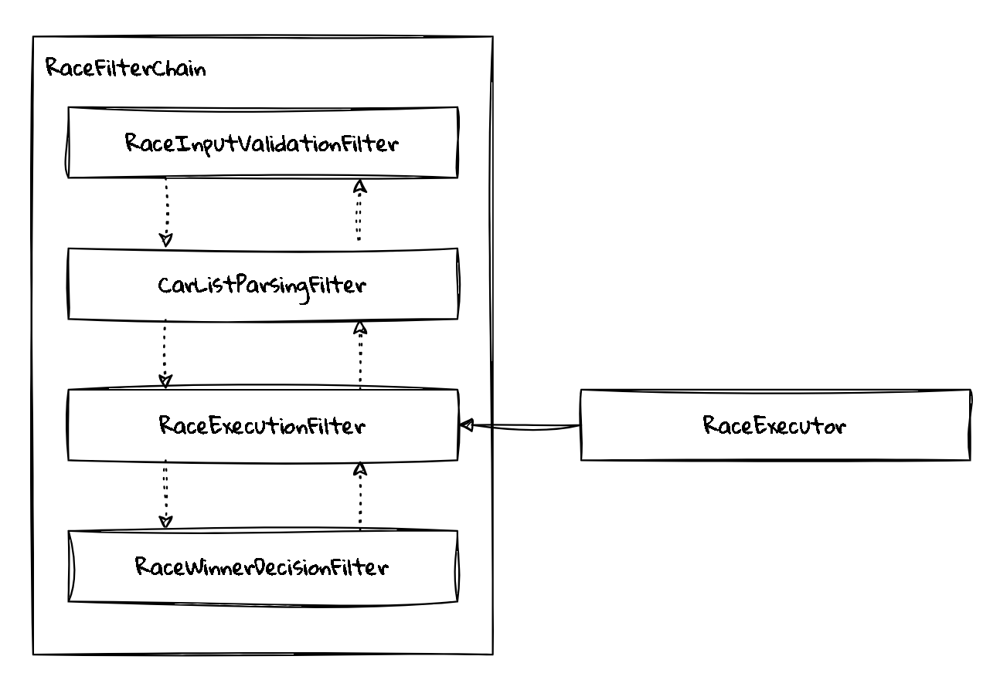
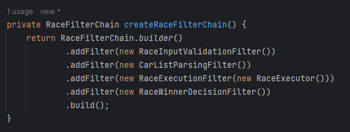
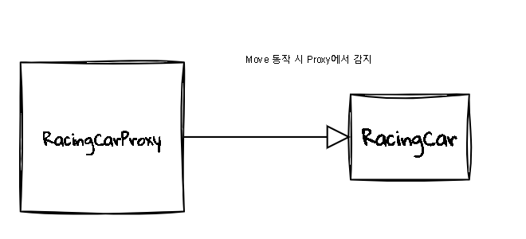

# 😊 우아한 테크코스 2주차 - 자동차 경주

## ⚙️ 기능 요구 사항

초간단 자동차 경주 게임을 구현한다.

- 주어진 횟수 동안 n대의 자동차는 전진 또는 멈출 수 있다.
- 각 자동차에 이름을 부여할 수 있다. 전진하는 자동차를 출력할 때 자동차 이름을 같이 출력한다.
- 자동차 이름은 쉼표(,)를 기준으로 구분하며 이름은 5자 이하만 가능하다.
- 사용자는 몇 번의 이동을 할 것인지를 입력할 수 있어야 한다.
- 전진하는 조건은 0에서 9 사이에서 무작위 값을 구한 후 무작위 값이 4 이상일 경우이다.
- 자동차 경주 게임을 완료한 후 누가 우승했는지를 알려준다. 우승자는 한 명 이상일 수 있다.
- 우승자가 여러 명일 경우 쉼표(,)를 이용하여 구분한다.
- 사용자가 잘못된 값을 입력할 경우 IllegalArgumentException을 발생시킨 후 애플리케이션은 종료되어야 한다.

## ✏️ 기능 요구 사항 분석

### 입력

1. n대의 자동차(자동차의 이름은 5자 이하)를 문자열로 입력(쉼표를 기준으로 구분).
2. 각 자동차가 이동 횟수 m를 입력.

### 내부 기능

1. 전진하는 조건을 위해 0~9사이의 무작위 값을 구함.

   1-1. 4이상일 경우만 전진, 나머지는 그대로 함.

2. 1의 조건을 m번 반복하여 경주를 진행.

   2-1. 라운드가 끝날 때마다 해당 경주의 히스토그램을 출력.

3. 최종 우승자 리스트를 반환

### 최종 출력

1. 최종 우승자를 출력

## 📋 개발 명세 TODO

- [x] **1. 입력 처리**
    - [x] 1-1. `n대의 자동차` 이름을 문자열로 입력받음
    - [x] 1-2. 각 자동차가 `m번 이동`할 횟수를 입력받음.

- [x] **2. 자동차 경주 전 처리작업**
    - [x] 2-1. "**1-1 의 내용**"에 기반한 문자열의 구분자가 쉼표(,)인지 확인
    - [x] 2-2. 자동차 이름이 5자 이하인지 검증.
    - [x] 2-3. "**1-1 의 내용**"에 기반한 문자열을 쉼표(,)를 기준으로 분해
    - [x] 2-4. 입력받은 자동차 이름 리스트로 자동차 객체 생성.
    - [x] 2-5. 각 자동차의 위치를 0으로 초기화.

- [x] **3. 경주 진행**
    - [x] 3-1. 입력받은 `m번` 만큼 경주를 반복.
    - [x] 3-2. 매번 반복할 때마다 각 자동차에 대해 전진 조건을 적용.
        - [x] 3-2-1. `0~9 사이의 무작위 값` 생성.
        - [x] 3-2-2. 무작위 값이 `4 이상`일 때만 자동차가 전진하도록 설정.
    - [x] 3-3. 라운드가 끝날 때마다 경주 상태(히스토그램)를 출력.

- [x] **4. 히스토그램 출력**
    - [x] 4-1. 각 자동차의 이름과 그에 따른 전진 결과를 히스토그램 형태로 출력.
        - [x] 4-1-1. 자동차가 전진한 거리에 따라 `'-'` 출력.

- [x] **5. 우승자 선정**
    - [x] 5-1. 경주가 끝난 후 가장 많이 전진한 자동차를 우승자로 선정.
    - [x] 5-2. 우승자가 여러 명일 경우 모두 리스트에 포함.

- [x] **7.최종 우승자 출력**
    - [x] 7-1.최종 우승자를 출력.

## 📜 개발 설명서

### ⛓️ RaceFilterChain 기본 개념

`RaceFilterChain`은 Chain of Responsibility (COR) 패턴에 기반하여 구성된 자동차 경주 게임의 구조입니다. 이 패턴을 통해 자동차 경주에 필요한 단계를 필터로 분리하여 유연하고
확장 가능한 시스템을 구축할 수 있습니다. 아래의 네 가지 주요 필터로 구성됩니다:

- **RaceInputValidationFilter**
- **CarListParsingFilter**
- **RaceExecutionFilter**
- **RaceWinnerDecisionFilter**

#### RaceInputValidationFilter

이 필터는 사용자가 입력한 초기 데이터를 검증하는 역할을 수행합니다. 요구 사항의 **조건 2-1~2-2**에 해당합니다. 주요 기능은 다음과 같습니다:

1. **입력 형식 검증**: 사용자가 입력한 자동차 이름이 쉼표(,)로 구분되어 있는지 확인합니다. 이 조건을 만족하지 않으면 `IllegalArgumentException`을 발생시킵니다.
2. **이름 길이 확인**: 각 자동차 이름이 5자 이하인지 검증합니다. 이 조건을 충족하지 않는 경우에도 예외를 발생시켜 애플리케이션이 종료됩니다. 이는 잘못된 입력으로부터 시스템을 보호하기 위함입니다.

#### CarListParsingFilter

이 필터는 자동차 이름 목록을 파싱하여 자동차 객체 리스트를 생성하는 역할을 합니다. 주요 기능은 다음과 같습니다:

1. **이름 분리**: 입력받은 문자열에서 쉼표(,)를 기준으로 자동차 이름을 분리합니다.
2. **자동차 객체 생성**: 각 이름을 바탕으로 자동차 객체를 생성하여 리스트에 저장합니다. 이 과정에서 이름의 유효성을 다시 확인할 수 있습니다.

#### RaceExecutionFilter

이 필터는 실제 경주를 진행하는 역할을 합니다. 주요 기능은 다음과 같습니다:

1. **경기 진행**: RaceExecutor내의 메소드를 진행하여 경기를 진행합니다.

#### RaceWinnerDecisionFilter

이 필터는 경주가 끝난 후 우승자를 선정하는 역할을 합니다. 주요 기능은 다음과 같습니다:

1. **최종 위치 평가**: 각 자동차의 최종 위치를 평가하여 가장 많이 전진한 자동차를 찾습니다.
2. **우승자 리스트 작성**: 여러 자동차가 동일한 최종 위치에 도달한 경우, 이들을 모두 우승자로 간주하고 리스트에 추가합니다.
3. **결과 반환**: 최종적으로 선정된 우승자 리스트를 반환하여 사용자가 쉽게 확인할 수 있도록 합니다.

### 🧩 빌더 패턴을 통한 유연한 필터 초기 구성

**ApplicationConfig**를 통해 초기 의존성 주입을 구성하였으며, 특히 **필터(Filter)** 부분을 좀 더 유연하게 처리하고자 빌더 패턴을 도입하였습니다. 이를 통해 필터 체인을 구성할 때 **체이닝(Chaining)** 구조를 사용하여 가독성을 높이고, 유연한 초기 구성을 가능하게 만들었습니다.

#### 빌더 패턴의 장점
- **가독성**: 체이닝 구조를 통해 여러 필터를 직관적으로 연결할 수 있으며, 각 필터의 추가나 제거가 한눈에 들어옵니다.
- **유연성**: 필터의 순서를 쉽게 변경하거나, 상황에 따라 필요한 필터만 적용할 수 있는 유연한 구성을 제공합니다. 이로 인해 각 필터의 역할이 명확해지고, 의존성 주입이 간편해집니다.
- **확장성**: 새로운 필터를 추가하거나 기존 필터를 수정할 때, 빌더 패턴을 통해 쉽게 확장할 수 있습니다. 필터 간의 결합도를 낮추어 유지보수도 용이해집니다.

빌더 패턴을 사용함으로써 필터 구성을 더 명확하게 표현할 수 있고, 필터 체인을 구성하는 과정에서 코드의 일관성을 유지할 수 있습니다.
### 🪞 RacingCarProxy를 통한 경기 히스토그램 출력

경기 히스토그램을 출력하는 부분을 "비즈니스 로직에 포함시키는 것이 적절할까?"라는 고민에서 출발하여 **RacingCarProxy** 구조를 도입하게 되었습니다. 이 구조는 동일한 인터페이스를 구현한 두 개의 클래스, **RacingCar**와 **RacingCarProxy**로 구성됩니다.

#### 구조
- **RacingCar**: 실제로 레이싱카에 관련 된 비즈니스 로직을 처리하는 기본 구현체입니다.
- **RacingCarProxy**: 프록시 객체로, **RacingCar**의 메소드를 호출하기 전에 중간에서 개입하여 추가적인 로직을 처리합니다. 여기에서는 경기 히스토그램 출력과 같은 부가적인 기능을 처리합니다.

#### 동작 원리
**RacingCarProxy**는 **RacingCar** 객체를 감싸고 있으며, 초기 객체 생성 시 인터페이스에 프록시를 주입합니다. 이로 인해 **RacingCar**의 메소드를 호출할 때 먼저 프록시가 실행되고, 그 후 실제 **RacingCar** 객체의 메소드가 호출됩니다. 이를 통해 **RacingCar**에서 메소드가 실행될 때마다 해당 결과에 대한 히스토그램 출력을 쉽게 처리할 수 있습니다.

#### 장점
이 패턴의 큰 장점은, 프록시를 제거해도 시스템에 큰 영향을 미치지 않는다는 점입니다. 객체 생성 시 프록시 대신 실제 **RacingCar** 객체를 주입해도 아무런 문제가 발생하지 않으며, 기존의 로직은 그대로 유지됩니다. 즉, 부가적인 기능을 쉽게 추가하거나 제거할 수 있어 유지보수에도 유리합니다.

이 구조를 통해 비즈니스 로직과 출력 로직을 분리하여 더 깔끔한 설계가 가능하고, 필요에 따라 언제든지 확장하거나 변경할 수 있는 유연성을 확보할 수 있습니다.