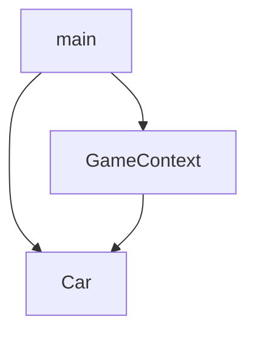

# java-racingcar-precourse

## 프로그래밍 요구 사항 1
- JDK 21버전에서 실행 가능해야 함
- 프로그램 실행의 시작점은 Application의 main()이다. 
- build.gradle 파일은 변경할 수 없으며, 제공된 라이브러리 이외의 외부 라이브러리는 사용하지 않는다. 
- 프로그램 종료 시 System.exit()를 호출하지 않는다. 
- 프로그래밍 요구 사항에서 달리 명시하지 않는 한 파일, 패키지 등의 이름을 바꾸거나 이동하지 않는다. 
- 자바 코드 컨벤션을 지키면서 프로그래밍한다. 
  - 기본적으로 Java Style Guide를 원칙으로 한다.

## 프로그래밍 요구 사항 2
- indent(인덴트, 들여쓰기) depth를 3이 넘지 않도록 구현한다. 2까지만 허용한다.
  - 예를 들어 while문 안에 if문이 있으면 들여쓰기는 2이다.
  - 힌트: indent(인덴트, 들여쓰기) depth를 줄이는 좋은 방법은 함수(또는 메서드)를 분리하면 된다.
- 3항 연산자를 쓰지 않는다. 
- 함수(또는 메서드)가 한 가지 일만 하도록 최대한 작게 만들어라. 
- JUnit 5와 AssertJ를 이용하여 정리한 기능 목록이 정상적으로 작동하는지 테스트 코드로 확인한다
 
## 기능 요구사항
초간단 자동차 경주 게임을 구현한다.

주어진 횟수 동안 n대의 자동차는 전진 또는 멈출 수 있다.
- 각 자동차에 이름을 부여할 수 있다. 전진하는 자동차를 출력할 때 자동차 이름을 같이 출력한다. 
- 자동차 이름은 쉼표(,)를 기준으로 구분하며 이름은 5자 이하만 가능하다. 
- 사용자는 몇 번의 이동을 할 것인지를 입력할 수 있어야 한다. 
- 전진하는 조건은 0에서 9 사이에서 무작위 값을 구한 후 무작위 값이 4 이상일 경우이다. 
- 자동차 경주 게임을 완료한 후 누가 우승했는지를 알려준다. 우승자는 한 명 이상일 수 있다. 
- 우승자가 여러 명일 경우 쉼표(,)를 이용하여 구분한다. 
- 사용자가 잘못된 값을 입력할 경우 IllegalArgumentException을 발생시킨 후 애플리케이션은 종료되어야 한다.

### 커스텀 기능 요구사항
- 플레이어 수는 1 이상 100 이하 범위를 만족한다.
- 플레이어의 이름의 길이는 1 이상 5 이하 범위를 만족한다.
- 이동 가능한 횟수는 1 이상 10,000이하 범위를 만족한다.

### 커스텀 비기능 요구사항
- 유지보수성을 올리기 위해, 테스트가 용이한 아키텍쳐를 유지해야 한다.

## 아키텍처 설계

## 구현 시 겪었던 문제점
- 알고리즘 자체는 단순해서 구현에는 큰 무리가 없었지만, 작성하고 보니 모두 main 에서 돌아가는, 통합 테스트만 가능한 프로그램이 됐다.
  - 따라서 빠르게 테스트가 용이한 아키텍처를 유지하기 위해 재설계를 수행했다.

- 랜덤 함수의 경우, 테스트를 진행하기 굉장히 까다로웠다
  - static 함수여서 Mock 으로 만들기도 까다로웠고, 원하는 결과값을 지정하여 출력시키기도 어려웠다
  - 그렇다고 우테코 라이브러리의 테스팅 함수를 사용하는 것은, 테스트 코드가 해당 라이브러리에 의존하게 되어, 좋은 코드가 아니라고 생각했다.
  - 따라서, 0부터 9 사이의 수 하나를 뽑는 과정 자체를 전략 패턴으로 뽑아내, 외부에서 주입받도록 하여 테스트가 용이하도록 구현하였다.