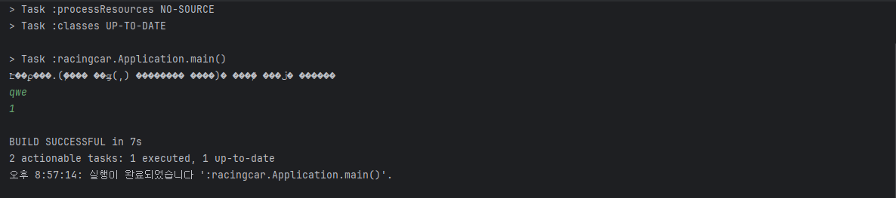
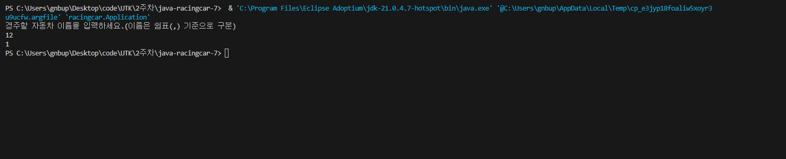
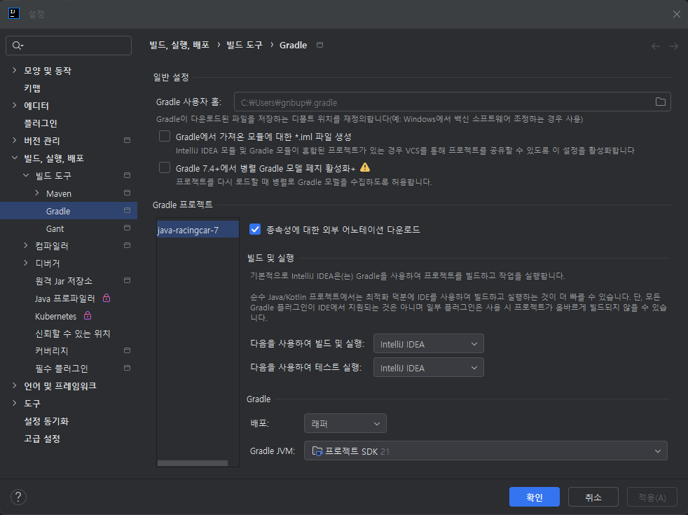
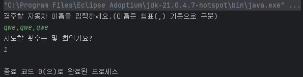

# java-racingcar-precourse
## 문제
자동차에 이름을 한줄로 입력받으며, 각 이름은 ','로 구분된다.
- 이름은 5자 이하일 것
  몇 회 이동할지도 입력받아야 한다.
- 반복중에 자동차는 전진할지 멈출지 랜덤함수를 통해 정해야 한다.
- 0~3 (40%) 멈춤, 4~9 (60%) 전진
  우승자를 출력한다.
- 우승자가 두 명이상일시 ','으로 구분하여 출력함 (순서는 아마 입력받은 순서대로인듯)
  사용자가 잘못된 값을 입력할 시 `IllegalArgumentException` 발생후 종료

### 입력
- 경주할 자동차
- 시도할 횟수
### 출력
- 차수별 실행 결과
- 우승자 안내 문구


## 개발 진행사항
### 주의사항
> 우승자가 다수일시, 출력 순서는 정해지지 않음
> 자동차의 수의 제한이 없기에 주의해야함
> 반복횟수의 제한이 결정 되지 않음
>
### 입력
- [X] 경주할 자동차 입력
    - [X] 자동차의 이름이 5자 이하인지 검증 (함수)
- [X] 반복 횟수 입력
- [X] 잘못된 입력 시 `IllegalArgumentException` 발생후 종료

### 출력
- [X] 차수별 실행 횟수 (함수)
    - [X] 입력한 숫자만큼 '-'을 출력 (함수)
- [X] 우승자를 찾아서 출력 (함수)
    - [X] 우승자가 둘 이상일시 ','로 구분하여 출력함

### 추가 함수
- [X] 전진여부 결정 (함수)
- [X] 반복 횟수만큼 차수별 실행 횟수을 보여주는 메서드 (함수)

## 공통 피드백
- 요구사항 준수할 것
> 이번 요구사항

```text
    들여쓰기의 깊이를 2개 이하로 제한한다.
    3항 연산자를 사용하지 않는다.
    함수와 메서드는 한 가지 일만을 수행하여야 한다.
    JUnit 5와 AssertJ를 이용하여 정리한 기능 목록이 정상적으로 작동하는지 테스트 코드로 확인한다.
```
- Git 명령어 숙지
1. fork후 clone
>git clone https://github.com/woowacourse/java-racingcar-7.git
>cd java-racingcar-7

2. 브랜치 생성
>git checkout -b bloodmoon3929
```text
    이전에는 하나의 브랜치로만 구현했었으나, 
    이제 feat/(기능명)으로 따로 빼서 개발 후 dev에 병합하여 
    최종적으로 다시 bloodmoon3929 브랜치에 병합할 예정
```
>git switch (브랜치명)

3. 기능 구현 후
>git status //변경된 파일 확인<br>
>git add . //변경사항 전부 반영<br>
>git commit -m "제목" - "본문"

4. 로컬에서 git 원격 저장소에 업로드
>git push origin bloodmoon3929

5. 브랜치 합치기
> git switch dev<br>
> git merge feat/Input<br>
> git push origin dev<br>

- 의미 있는 커밋 메시지
```text
    50자 이내의 요약문장과 설명문 사이에 빈 줄 하나를 만들것
    제목은 영문 기준으로 50자 이내, 첫 글자는 대문자, 명령조로 
    본문의 72마다 줄바꿈
    본문의 내용은 무엇을, 왜를 기준으로 작성
```
- 의미있는 이름
> 변수, 함수, 클래스이름을 길어도 좋으니 의도가 들어나게 작성하라.

- 주석을 지양
> 함수가 한 눈에 보고 이해할 수 있다면, 주석을 달지 마라.
> 이해가 어려울 경우에만 주석을 달아라

- 코드 포메팅 사용
> ctrl+Alt+L로 정렬가능

- 자바의 API 적극 활용
> 함수 구현하기 전, API가 있는지 확인후 코딩하기

- 배열보다 컬렉션
> List, Set, Map등을 사용하여 쉬운 데이터 조작이 가능하다.


## 라이브러리
입력
```java
import camp.nextstep.edu.missionutils.Console;
readLine();
```
랜덤
```java
import camp.nextstep.edu.missionutils.Randoms;
pickNumberInRange();
```
터미널에서 돌릴시 정상 작동하지만, ApplicationTest에서 돌릴 시 (4,3,3,3,3,3,3,3,3,3) 반환함<br>
테스트 하기 위해 이런식으로 동작하는 듯함

# 오류
## 10/22
저번 주에는 vscode에서 개발을 진행하였으나 느린 속도에 inteliJ에서 개발을 진행하는 중인데 오류가 발생하였다.<br>
<br>
inteliJ에서 한글 인코딩이 깨지는 문제가 발생하였다.<br>
다양한 해결법을 찾아 보았으나, 한글이 되는 경우가 없었다.<br>
1. vmoptions (X)
2. console- default encoder (X)
3. file encoder (X)
4. 실행파일 vmoptions (X)

혹시나 해 vscode에서 돌려보았다.<br>
<br>
역시 정상 출력하였다.

## 10/23
<br>
빌드를 기본 값인 gradle에서 하는 것이 아닌 intelliJ의 터미널에서 돌림으로써 해결했다.<br>
<br>