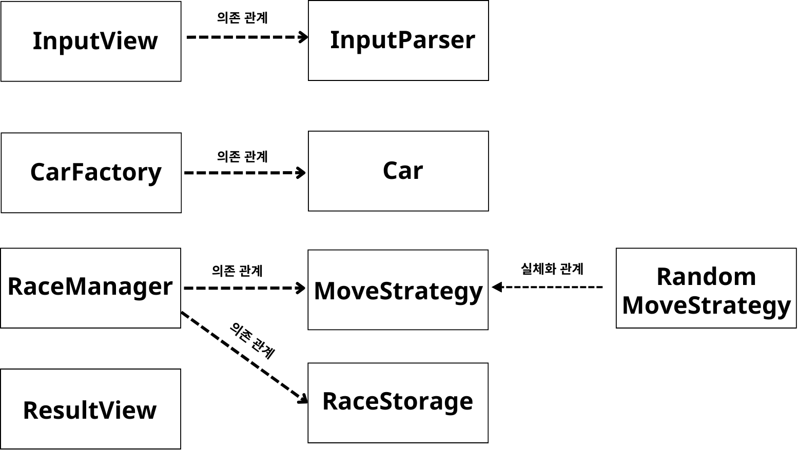

# java-racingcar-precourse

## 잘못된 입력 정의
- 자동차 이름은 공백이 불가하다.
- 자동차 이름은 중복을 허용하지 않는다.
- 시도 횟수는 양수만 가능하다.

## 핵심 기능
- 사용자 입력을 받는 기능(InputView)
- 자동차 이름, 시도 횟수 추출 기능(InputParser)
  - 이름이 공백인지 검사
  - 이름이 5자 이하인지 검사
  - 시도횟수가 양수인지 검사
- 이름을 통해 자동차 객체 목록 생성(CarFactory)
- 랜덤수에 따라 자동차 전진 기능(RaceManager)
- 우승자 선정(RaceManager)
- 자동차 전진 상황, 우승자 출력 기능(ResultView)

### 객체 관계도
