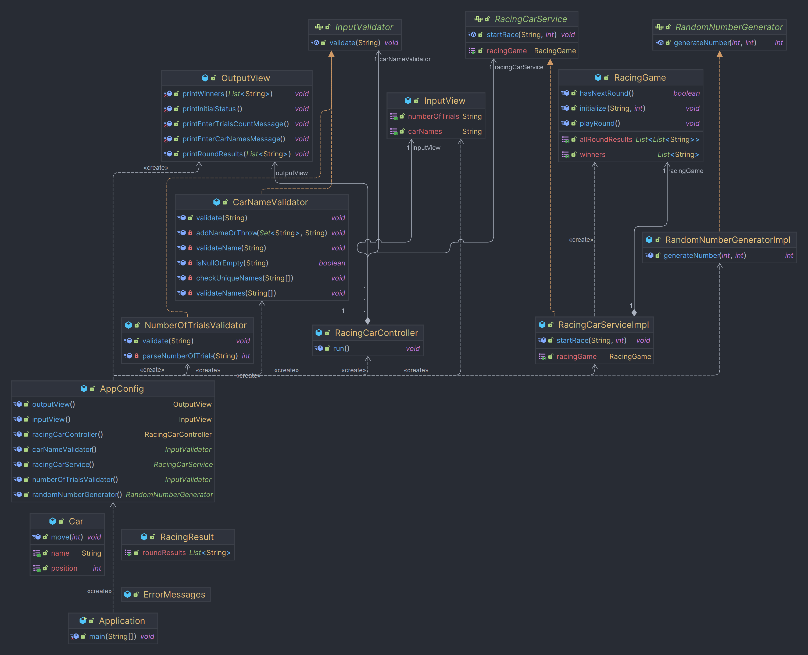

# java-racingcar-precourse

## 📌프로젝트 흐름

    - 프로그램이 시작되면 "경주할 자동차 이름을 입력하세요.(이름은 쉼표(,) 기준으로 구분)"가 출력되고 사용자로부터 입력을 받는다.
    - "시도할 횟수는 몇 회인가요?"문구가 출력되고 사용자로부터 입력을 받는다.
    - 차수별로 실행결과(자동차, "-" )가 출력된다.
    - 모든 차수가 끝나고 최종 우승자를 출력하며 프로그램이 종료된다.

## 📑구현할 기능 목록

- 자동차를 입력받는다

    - [x] 입력시작문구가 출력되고 사용자로부터 입력을 받는다.

- 입력받은 값을 확인한다

    - [x] 입력받은 값 중 예외처리 할 것을 체크한다.
        - [x] 아무것도 안 들어올 경우 예외처리한다.
        - [x] 쉼표(,)가 연속으로 들어올 경우 예외처리한다.
        - [x] 쉼표(,)만 들어온 경우 예외처리한다.
        - [x] 이름이 5자 이하가 아닌 경우 예외처리한다.
        - [x] 쉼표와 이름 사이의 공백은 허용한다 -> 후에 공백 제거를 하며 처리할 예정

- 시도 횟수를 입력받는다

    - [x] 시도횟수입력문구가 출력되고 사용자로부터 입력을 받는다.
    - [x] 입력값이 자연수가 아닌 경우 예외처리한다.

- 자동차 게임을 시행한다

    - [x] 입력받은 시도횟수만큼 게임을 시행한다.
    - [x] 무작위 값을 생성한다(camp.nextstep.edu.missionutils.Randoms의 pickNumberInRange() 사용)
    - [x] 무작위 값이 4 이상일 경우 전진한다.
    - [x] 전진한만큼 "-"를 출력한다.

- 최종 우승자를 출력한다

    - [x] 우승자가 단일일 경우 "최종 우승자 : pobi"로 출력하고 복수일 경우 "최종 우승자 : pobi, jun"형식으로 출력한다.

## 📑테스트한 기능 목록

- 출력문구 확인
    - 게임시작문구가 올바르게 출력되는지 확인
    - 시도횟수 입력문구가 올바르게 출력되는지 확인

- 자동차 입력 시
    - 자동차 이름이 5글자 초과인 경우 예외처리
    - 쉼표 앞 뒤로 이름이 들어오지 않은 경우 예외처리
    - 아무것도 입력되지 않은 경우 예외처리
    - 이름이 중복으로 들어온 경우 예외처리

- 시도 횟수 입력 시
    - 자연수가 아닌 값이 들어온 경우 예외처리
    - 0이 입력될 시 예외처리
    - 숫자 이외의 값들(문자 등)이 들어온 경우 예외 처리

- 자동차 게임 진행 시
    - 공동 우승자일 경우 ,를 기준으로 여러명을 표기
    - 단일 우승자일 경우 , 없이 우승자 이름만 표기
    - 랜덤 값이 4이상일 경우만 전진 가능
    - 생성자는 이름으로 구성된 gameCar를 반환
    - 올바른 문자열이 들어올 경우 자동차 인스턴스로 된 리스트 반환

## 📑구조 시각화

