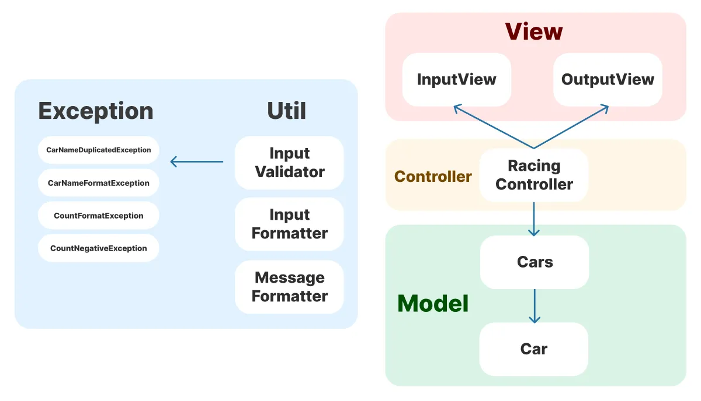

# java-racingcar-precourse

## 📍 기능 구현 목록

### 입출력

- [x] 사용자로부터 자동자 이름과 이동 횟수를 입력받는다.
- [x] 경기 시도횟수만큼 자동차들의 현재 정보(이름, 전진 거리)를 출력한다.
- [x] 최종 우승자를 출력한다.

### 게임 진행

- [x] 입력 받은 자동차 이름을 기반으로 자동차를 생성한다.
- [x] 입력받은 횟수만큼 자동차들을 전진시킨다.
- [x] 각 횟수마다 모든 자동차의 이동 현황을 출력한다.
- [x] 이동 거리가 가장 긴 최종 우승자를 선정한다.

### 자동차

- [x] 랜덤값을 뽑아서, 이를 기반으로 자동차를 전진시키거나 멈춘다.
- [x] 자동차의 이름과 이동 현황을 '-'를 이용하여 시각화한다.

### 예외

- [x] 잘못된 입력값에 대해 IllegalArgumentException을 발생시키고 애플리케이션을 종료시킨다.

### 테스트

- [x] 구현한 기능별로 단위 테스트를 진행한다.

## 🎆 클래스 의존성 다이어그램

