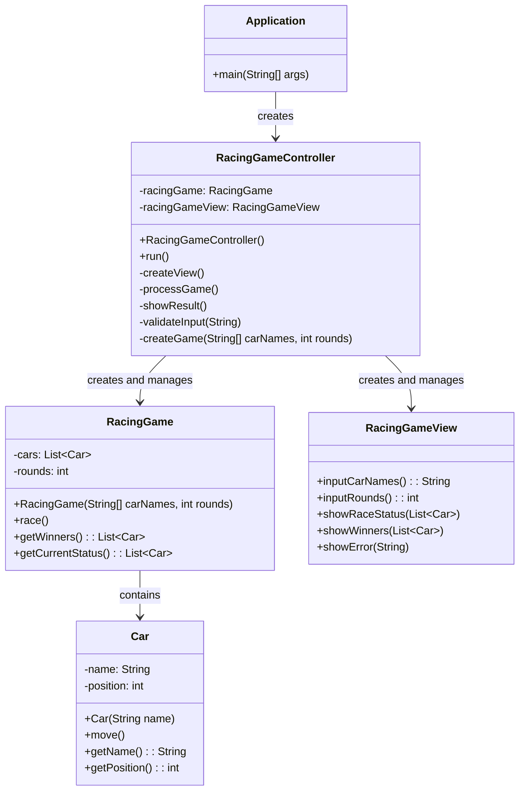

# 초간단 자동차 경주 게임

## 기능 요구 사항
1. **자동차 이름 입력**
   - 쉼표(,)를 기준으로 자동차 이름을 구분합니다.
   - 자동차 이름은 최대 5글자까지만 가능합니다.
   - 사용자가 잘못된 값을 입력할 경우 `IllegalArgumentException`을 발생시키고 애플리케이션을 종료합니다.

2. **시도할 횟수 입력**
   - 사용자는 자동차가 전진할 횟수를 입력해야 합니다.

3. **자동차 경주 진행**
   - 각 자동차는 0에서 9 사이의 무작위 값에 따라 전진하거나 멈춥니다.
   - 무작위 값이 4 이상인 경우 자동차가 전진합니다.
   - 각 라운드에서 자동차의 이름과 전진 결과를 출력합니다.

4. **우승자 결정**
   - 경주가 끝난 후 우승자를 결정하여 출력합니다.
   - 여러 대의 자동차가 동점인 경우, 우승자는 쉼표(,)로 구분하여 출력합니다.

## 입출력 요구 사항
### 입력
- 경주할 자동차 이름 (이름은 쉼표(,)로 구분)
    ```
    pobi,woni,jun
    ```
- 시도할 횟수
    ```
    5
    ```

### 출력
- 각 라운드 결과
    ```
    pobi : --
    woni : ----
    jun : ---
    ```
- 최종 우승자
    ```
    최종 우승자 : pobi, jun
    ```

## 프로그래밍 요구 사항
1. **JDK 21**에서 실행 가능해야 합니다.
2. **들여쓰기(indent)** 깊이는 최대 2까지만 허용합니다.
3. **JUnit 5**와 **AssertJ**를 사용하여 테스트 코드를 작성해야 합니다.
4. **camp.nextstep.edu.missionutils**에서 제공하는 `Randoms`와 `Console API`를 사용합니다.


# 자동차 경주 게임 구현 체크리스트

## 과제 진행 요구 사항
- [x] 미션 저장소를 포크하고 클론하여 시작한다.
- [x] 기능을 구현하기 전 README.md에 구현할 기능 목록을 정리해 추가한다.
- [ ] AngularJS Git Commit Message Conventions에 맞춰 커밋 메시지를 작성한다.

## 기능 요구 사항
- [ ] 주어진 횟수 동안 n대의 자동차는 전진 또는 멈출 수 있도록 구현한다.
- [ ] 각 자동차에 이름을 부여하고, 전진하는 자동차의 이름을 출력한다.
  - [ ] 자동차 이름은 쉼표(,)로 구분한다.
  - [ ] 이름은 5자 이하만 허용한다.
- [ ] 사용자가 시도할 횟수를 입력할 수 있도록 한다.
- [ ] 0에서 9 사이 무작위 값을 생성하여 4 이상일 경우 전진하도록 한다.
- [ ] 경주 종료 후 우승자를 표시한다.
  - [ ] 우승자가 여러 명일 경우 쉼표(,)로 구분한다.
- [ ] 잘못된 값 입력 시 `IllegalArgumentException`을 발생시키고 애플리케이션을 종료한다.

## 입출력 요구 사항
- [ ] 경주할 자동차 이름을 쉼표(,) 기준으로 입력받는다.
- [ ] 시도할 횟수를 입력받는다.
- [ ] 차수별 실행 결과를 출력한다.
- [ ] 단독 우승자 안내 문구를 출력한다.
- [ ] 공동 우승자 안내 문구를 출력한다.

## 프로그래밍 요구 사항
- [ ] JDK 21 버전에서 실행 가능하도록 한다.
- [ ] 프로그램 실행의 시작점은 `Application`의 `main()`으로 한다.
- [ ] `build.gradle` 파일을 변경하지 않고 제공된 라이브러리 외의 외부 라이브러리를 사용하지 않는다.
- [ ] 프로그램 종료 시 `System.exit()`를 호출하지 않는다.
- [ ] 파일, 패키지의 이름을 바꾸거나 이동하지 않는다.
- [ ] Java Style Guide를 준수하며 프로그래밍한다.

## 프로그래밍 요구 사항 2
- [ ] indent depth를 2까지만 허용한다.
- [ ] 3항 연산자를 사용하지 않는다.
- [ ] 함수가 한 가지 일만 하도록 최대한 작게 분리한다.
- [ ] `JUnit 5`와 `AssertJ`를 이용하여 테스트 코드를 작성하고 모든 기능을 검증한다.

## 라이브러리 사용 요구 사항
- [ ] `camp.nextstep.edu.missionutils`의 `Randoms` 및 `Console` API를 사용하여 구현한다.
  - [ ] `Randoms.pickNumberInRange(0, 9)`를 사용하여 0에서 9 사이의 무작위 값을 추출한다.
  - [ ] `Console.readLine()`을 사용하여 사용자 입력을 받는다.

## 디자인 패턴 적용 요구 사항
- [ ] 각 역할을 분리하여 MVC 패턴으로 설계한다. -> 아래의 클래스 다이어그램을 참고한다.
- [ ] 싱글톤 패턴을 적용하여 객체의 생성을 제한하고 동일 객체를 재사용한다.

# 프로그램 클래스 다이어그램
