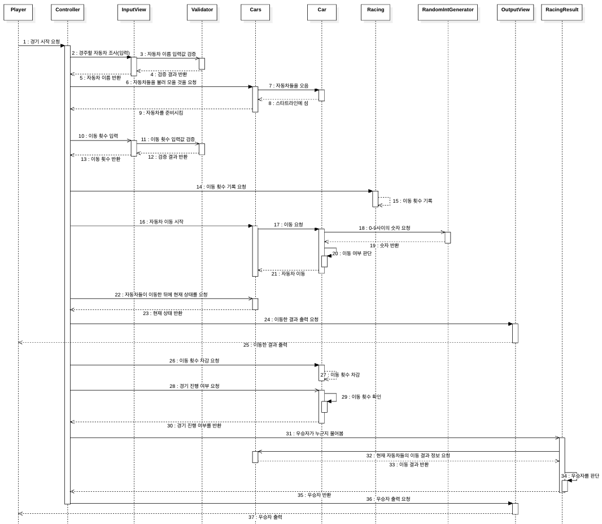

# java-racingcar-precourse

## 구현할 기능 목록
### 자동차
#### Car
- [x] 자동차 객체를 생성한다.
- [ ] 이동 가능 여부를 판단한다.
- [ ] 이동 가능 여부에 따라 이동한다.
- [x] 자동차 이름을 조회한다.
- [x] 현재 자동차의 위치를 조회한다.
#### Cars
- [ ] 경주에 참가하는 자동차 객체 리스트를 생성한다.
- [ ] 각 자동차에 이동을 요청한다.
- [ ] 경주에 참가하는 자동차 객체 리스트를 조회한다.
- [ ] 가장 멀리 간 자동차의 거리를 반환한다.
#### RandomIntGenerator
- [ ] 0-9 사이의 숫자를 생성한다.
### 경주
#### Racing
- [ ] 처음 이동 횟수를 기록한다.
- [ ] 이동횟수를 차감한다.
- [ ] 이동 횟수에 따라 경기 진행 및 종료 여부를 판단한다.
#### RacingResult
- [ ] 우승 자동차를 결정한다.
- [ ] 우승 자동차를 반환한다.

### 입력
#### InputView
- [ ] 경주할 자동차를 입력받는다.
- [ ] 이동할 횟수를 입력받는다.

#### OutputView
- [ ] 경주 시작 메시지를 출력한다.
- [ ] 각 이동 단계마다 이동 결과를 출력한다.
- [ ] 최종 우승 자동차를 출력한다.

### Controller
#### RacingController (운영자)
- [ ] 경주를 각 단계(횟수)에 따라 실행한다.
- [ ] 경주의 흐름 및 상태를 정리한다.
- [ ] 어시스턴트에게 자동차 이동을 요청한다.

### Validator
#### InputValidator
- [ ] InputCarNamesValidator
    - [ ] 자동차 이름이 5자 이하인지 검증한다.
    - [ ] 자동차 이름이 중복 입력되었는지 검증한다.
    - [ ] 공백이 입력되었는지 확인한다.
- [ ] InputCountValidator
    - [ ] 이동 횟수가 0 이상의 숫자인지 검증한다.
    - [ ] 입력한 숫자의 자료형 범위를 확인한다.
    - [ ] 공백이 입력되었는지 확인한다.

-- -- 
## 문제 분석
#### 지난주 피드백
- 코드가 길어서 가독성이 떨어진다. -> 역할과 책임 분배가 제대로 되지 못함.
- 시퀀스 다이어그램을 통해 흐름을 알 수 있어서 각 클래스 역할을 알아보기 편했다.
- 위와 같은 피드백을 수용하기 위해 이번주에는 "객체지향의 사실과 오해"를 읽고, 시나리오를 자세하게 쓰되 시나리오에 따라서 협력, 책임, 역할로 구분하였다.
- 시퀀스 다이어그램은 유지한다.

#### 시나리오
#### 역할: 사회자, 운영자, 경기기록자, 심판, 어시스턴트, 자동차
#### 협력 목표:
- n개의 자동차가 k번의 이동 횟수(스테이지)에서 가장 멀리 이동한 자동차를 가려내는 것
1. 사회자는 경주할 자동차를 조사한다.
2. 사회자는 조사한 자동차들을 운영자에게 전달한다.
3. 운영자는 어시스턴트에게 부탁해 자동차들을 불러 모은다.
4. 운영자는 이동 횟수(스테이지수)를 경기기록자에게 기록하라고 한다.
5. 사회자는 자동차 경주를 시작한다.
6. 운영자는 어시스턴트에게 자동차가 움직일 것을 전달한다.
7. 어시스턴트는 자동차들에게 이동할 것을 요청한다.
8. 자동차들은 스스로 판단하여 이동한다.
9. 어시스턴트는 각 자동차의 이동거리를 확인한다.
10. 운영자는 어시스턴트로부터 정보를 전달받고 사회자에게 스테이지 결과를 발표 해달라고 말한다.
11. 사회자는 스테이지 결과를 발표한다.
12. 운영자는 경기기록자에게 이동 횟수를 차감하라고 말한다.
13. 경기기록자는 이동횟수를 차감한다.
14. 운영자는 경기기록자에게 경기 진행 여부를 물어본다.
15. 경기기록자는 이동횟수가 남았는지 확인한다.
16. 경기기록자는 경기 진행 여부를 운영자에게 전달한다.
17. 운영자는 전달받은 정보에 따라 경기를 진행하거나 종료한다.
18. 운영자가 심판에게 우승자를 물어본다.
19. 심판은 우승자를 판단하고 운영자에게 우승자를 전달한다.
20. 사회자는 우승자를 발표한다.

#### 협력
협력은 요청과 응답으로 구성 (다수의 연쇄적인 요청과 응답의 흐름)

- 자동차 경주 시작을 요청
    - 자동차 경주를 시작
- 사회자가 경주할 자동차를 조사
    - 어시스턴트에게 경주할 자동차 리스트를 전달하고 불러올 것을 요청
    - 어시스턴트가 경주할 자동차들을 불러 모음("빨간 자동차, 파란 자동차, 노란 자동차 오세요!")
    - 어시스턴트는 스타트 라인으로 자동차들이 서게함
- 운영자가 이동할 횟수를 기록할 것을 요청
    - 경기기록자는 이동할 횟수를 기록
- 운영자가 각 이동 단계마다 어시스턴트에게 자동차들이 이동할 것을 요청
    - 어시스턴트는 자동차 이동 요청에 따라 각 자동차에 이동할 것을 요청
    - 각 자동차들은 스스로 이동할지 여부를 판단하여 이동
- 운영자가 자동차들의 현재 스테이지 위치를 요청
  - 어시스턴트는 현재 자동차들의 위치를 확인하고 진행자에게 전달
- 운영자가 사회자보고 전달받은 자동차들의 위치를 말해달라고 요청
    - 사회자는 운영자로부터 받은 정보를 외침
- 운영자가 이동 횟수를 차감해달라고 경기기록자에게 요청
    - 경기기록자는 이동 횟수를 차감함
- 운영자는 경기 진행 여부를 경기기록자에게 요청
    - 경기기록자는 이동 횟수에 따라 경기 진행(반복) 및 경기 종료(반복 종료)를 판단
    - 경기기록자는 판단한 결과를 운영자에게 알려줌
    - 운영자는 판단 결과에 따라 경기를 진행하거나 종료
- 운영자는 심판에게 우승자를 누구인지 정보 요청
    - 심판은 우승자를 판단하여 우승자를 운영자에게 전달
- 운영자는 우승자를 전달받고 이를 사회자에게 발표할 것을 요청
    - 사회자는 우승자를 발표하고 경주를 종료

#### 책임
책임은 무엇을 알고 있는가와 무엇을 할 수 있는가로 나눔

**사회자**
- 하는 것:
    - 경주할 자동차를 모집한다.
    - 차수마다 그 결과를 발표한다.
    - 우승자를 발표한다.

**운영자**
- 하는 것:
    - 어시스턴트에게 자동차들이 이동할 것을 요청한다.
    - 이동한 뒤에 자동차들의 상태를 말할 것을 요청한다.
    - 이동 횟수 차감을 요청한다.
    - 경기를 진행하거나 종료한다.

**경기기록자**
- 하는 것:
    - 이동 횟수를 기록한다.
    - 이동 횟수에 따른 경기 진행 여부 판단한다.
- 아는 것:
    - 남은 이동 횟수
    - 경기 진행 여부

**어시스턴트**
- 하는 것:
    - 자동차들이 스타트 라인에 서게 한다.
    - 각 자동차에 이동 요청을 한다.
    - 가장 멀리간 자동차의 위치를 계산한다.
- 아는 것:
    - 게임에 참가한 자동차들
    - 가장 멀리간 자동차의 위치

**심판**
- 하는 것:
    - 경주 결과를 토대로 우승자를 판단한다.
- 아는 것:
    - 자동차들의 최종 주행 거리

**자동차**
- 하는 것:
    - 이동 가능 여부를 판단한다.
    - 이동 가능 여부에 따라 이동한다.
- 아는 것:
    - 이동할 수 있는지 없는지에 대한 여부
    - 자동차의 이름 (나)
    - 자동차의 위치 (나)

-- -- 
## 클래스 설계
- MVC 패턴을 사용했습니다.
- Validator를 사용했습니다.
### Model
#### Car (자동차)
- 자동차 객체를 생성한다.
- 이동한다.
- 이동 가능 여부를 판단한다.
- 자동차 이름을 조회한다.
- 자동차의 현재 포지션을 조회한다.

#### Cars (어시스턴트)
- 경주에 참가하는 자동차 객체 리스트를 생성한다.
- 각 자동차에 이동을 요청한다.
- 경주에 참가하는 자동차 객체 리스트를 반환한다.
- 가장 멀리 간 자동차의 거리를 반환한다.

#### Racing (경기기록자)
- 초기 이동 횟수를 기록한다.
- 이동 횟수를 차감한다.
- 이동 횟수에 따라 경기 진행 및 종료 여부를 판단한다.

#### RacingResult (심판)
- 우승 자동차의 이름을 반환한다.
- 우승 자동차를 결정한다.

#### RandomIntGenerator
- 0~9 사이의 숫자를 생성한다.

### View
#### InputView
- 경주할 자동차를 입력받는다.
- 이동할 횟수를 입력받는다.

#### OutputView
- 경주 시작 메시지를 출력한다.
- 각 스테이지마다 이동 결과를 출력한다.
- 최종 우승 자동차를 출력한다.

### Controller
#### RacingController (운영자)
- 경주 환경을 준비한다.
- 경주를 각 단계(횟수)에 따라 실행한다.
- 경주의 흐름 및 상태를 정리한다.
- 경기 진행 및 종료 여부에 따라 경주를 진행한다.

### Validator
#### InputValidator
- InputCarNamesValidator
    - 자동차 이름이 앞뒤 공백 제외, 5자 이하인지 검증한다.
    - 자동차 이름이 중복 입력되었는지 검증한다.
    - 공백이 입력되었는지 확인한다.
- InputCountValidator
    - 이동 횟수가 1 이상의 숫자인지 검증한다.
    - 입력한 숫자의 자료형 범위를 확인한다.
    - 공백이 입력되었는지 확인한다.

## 시퀀스 다이어그램

