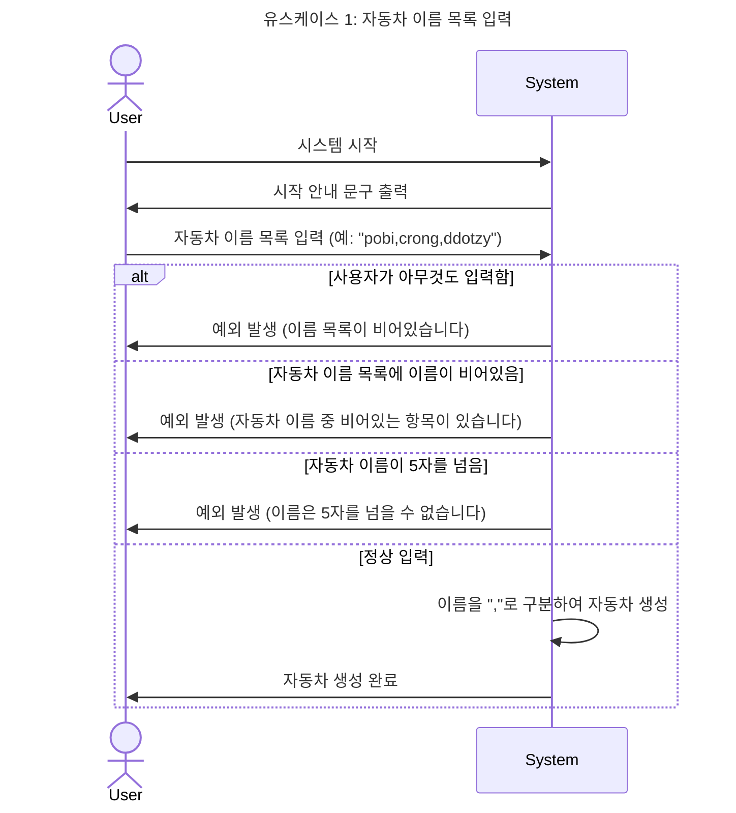
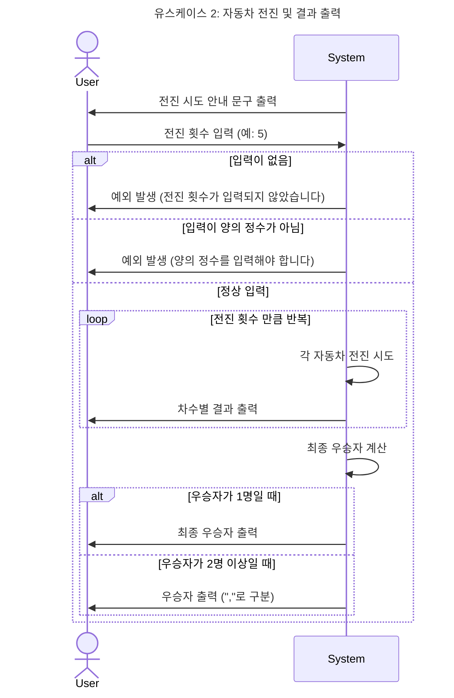

# java-racingcar-precourse

## A. 구현한 기능 목록

### 1. 자동차 목록 문자열을 "," 기준으로 구분한다.

#### 1-1 : 자동차 이름이 비어있거나("") 공백이면(" ") 예외를 발생시킨다.

#### 1-3 : 자동차 이름과 각 자동차의 전진 횟수를 저장한다.

#### 1-2 : 사용자가 5자가 넘는 이름을 입력하면 예외를 발생시킨다.

#### 1-4 : 자동차 이름 영역에 공백이 존재하면 예외를 발생시킨다.

### 2. 전진 메서드 구현 : 0 ~ 9 사이 무작위 값(0~3: 정지, 4~9: 전진)

#### 2-1 : Randoms.pickNumberInRange(0, 9); 호출하고 전진 조건 적용

### 3. 자동차 전체에 대해 전진을 적용한다.

#### 3-1 : for-each(car : cars)로 2-1 호출

### 4. 안내 문구를 출력한다.

#### 4-1 : 시작 안내 문구를 출력한다.

#### 4-2 : 전진 시도 안내 문구를 출력한다.

#### 4-3 : 실행 결과 안내 문구를 출력한다.

### 5. 전진 차시에 따른 결과를 출력한다

#### 5-1 : 변하는 상태에 대한 참조이므로 옵저버 패턴을 적용한다.

#### 5-2 : 각 차시 출력 후 빈 줄을 삽입한다.

### 6. 자동차 이름 목록 입력 값을 검증한다.

#### 6-1 : 빈 값을 입력하면 예외를 발생시킨다.

#### 6-2 : 같은 이름이 여러번 입력되면 하나로 취급한다.

### 7. 전진 횟수 입력 값을 검증한다.

#### 7-1 : 양수가 아닌 값이 입력되면 예외처리(정수범위를 넘어가는 것은 무시)

### 8. 입력 서비스를 구현한다.

#### 8-1 : readLine

#### 9. 통합한다.

---

## B. 구현할 기능 목록

(완료)

- 객체지향적으로 리팩토링

## C. 기능 구현을 위해 고민한 것

#### 1-3-1. 자동차 집합과 각 자동차는 어떻게 구현하는가

##### 1-3-0 결론적으로 HashMap extends 채택

1. 이름과 연결괸 상태 하나 저장
2. 기능 추가 및 확장 가능성 없음(프리코스 미션 고정)
3. 이름 추가, 전진, 전진 상태 통보, 우승자 선정 인터페이스 만들면 됨
    1. Cars가 HashMap을 확장하며 해당 인터페이스를 구현

##### 1-3-1 HashMap(채택)

1. 자동차 집합(Cars) => HashMap 객체
2. 각 자동차(Car) => HashMap Key
    - 생성은?
        1. add(name, 0) => 0 초기화
        2. Set 입력 받아 각 요소별로 저장 및 초기화?
        3. 자동차 목록 문자열 입력 받고 값을 분리하는 메서드를 추가?
3. 전진 상태(location) => HashMap Value
4. 전진 명령 전달(go)
    1. Map에게 적용
        - Key 순회로 각각 적용? keySet 있음
        - 해당 Map extends 해서 추가 가능할 것 같다.
    2. ArrayList goResult
        - for(전진횟수) {go()}; => goResult에 저장
        - for(goOrNot: goResult){ Map에 순서대로 저장 }
        - 차수별 결과 저장을 위한 별도 객체 필요
    3. HashMap 확장?

##### 1-3-2 `List<Car>` {id="구현-고민-List"}

1. 자동차 집합(Cars) => List 객체
2. 각 자동차(Car) => Car 객체 하나 만들어야 함
3. 전진 상태(location) => Car 객체가 저장
    - 생성은 어떻게?
        - Car car = new Car(carName); carList.add(car);
    - 조회 기능 구현 필요
    - 전진 상태 변화, 조회 기능 구현 필요
4. 전진 명령 전달(go)
    1. List에게 적용
        - 순회로 적용?
        - List extends 하면?

##### 1-3-3 Composite 패턴

1. 자동차 집합(Cars) => 컴포넌트 객체
2. 각 자동차(Car) => 컴포지트 객체
    - 생성은 어떻게? 위에서 고민한 내용 전체 구현해야함
3. 전진 상태(location) => 위에서 고민한 내용 전체 구현해야함
4. 전진 명령 전달(go) => 위에서 고민한 내용 전체 구현해야함

#### 1-3-2. MVC 패턴을 적용해야할까? 적용한다면 언제 어떻게 적용해야하는가?

1. MVC 패턴을 적용한다면.
    - Model : Cars
    - View : SystemView, RaceView
    - Controller : 없음, Application 이 대신하고 있음
2. 옵저버 패턴 필요
    - Subject : Model
    - Observer : View, Controller 
3. 전략 패턴 필요
   - 뷰가 화면 처리, 컨트롤러는 뷰의 이벤트 리스너

#### 1-3-3. 입력 값을 받기위해 readLine을 호출한 후 언제 close를 호출해야하는가?

---

## D. 요구 사항 분석

### D-1. 유스케이스 1: 자동차 이름 목록 입력

    1. 사용자가 시스템을 시작한다.
    2. 시스템은 시작 안내 문구를 출력한다.
    3. 사용자가 자동차 이름 목록을 입력한다.
      3.a : 사용자가 아무것도 입력하지 않고 엔터를 누르면 예외를 발생시킨다.
    4. 시스템은 자동자 이름 목록을 ","를 기준으로 나눠 자동차를 생성한다.
      4.a : 자동차 중에 이름이 비어있으면 예외를 발생시킨다.(pobi,,ddotzy)
      4.b : 사용자가 5자가 넘는 이름을 입력하면 예외를 발생시킨다.

### D-2. 유스케이스 2: 자동차 전진 및 결과

    1. 시스템이 전진 시도 안내 문구를 출력한다.
    2. 사용자가 전진을 시도할 횟수를 입력한다.
       2.a : 사용자가 아무것도 입력하지 않으면 예외를 발생시킨다.
       2.b : 사용자가 양의 정수가 아닌 입력을 하면 예외를 발생시킨다.
    3. 시스템은 입력된 횟수 만큼 모든 자동차에 대해 각각 전진을 시도한다.
    4. 주어진 시도가 끝날 때까지 각 차수의 결과를 출력한다.
    5. 최종 우승자를 출력한다.
       9.a : 우승자가 2명 이상이면 ","로 구분한다.

### D-3 입력 정의:

1. 자동차 이름 목록
    - 5자 이내 문자, 넘으면 예외
    - ","로 연결
    - 빈 문자(""), 공백(" ")이 포함된 입력은 예외 발생 시킴
2. 시도 횟수
    - 양의 정수
    - 음수, 문자 입력시 예외 발생 시킴
    - 정수 범위를 넘는 입력은 생각하지 않음

### D-4 다이어그램

#### 유스케이스 1: 자동차 이름 목록 입력



#### 유스케이스 2: 자동차 전진 및 결과 출력



## E. 기능 요구 사항 요약

> 초간단 자동차 경주 게임을 구현한다.

- "주어진 횟수" 동안 **"n대"의 `자동차`** [`전진` 또는 `정지`]
- 각 `자동차`에 `이름` 부여
- [전진하는 자동차를 `출력`]할 때 "`자동차 이름` 같이 출력"
- [자동차 이름 입력]시 "쉼표(,) 기준으로 구분"
    - "이름은 5자 이하"만 가능하다.
- 사용자가 이동 횟수 입력할 수 있어야함
- 전진 조건 : 0 ~ 9 사이 무작위 값, 무작위 값이 4 이상일 경우 => (0~3: 정지, 4~9: 전진)
- 게임 완료한 후, 우승자 출력
    - 우승자는 한 명 이상
    - 공동 우승 시 쉼표(,)를 이용해 구분한다.
- 사용자가 잘못된 값을 입력 => IllegalArgumentException을 발생, 애플리케이션은 종료

### E-1 입출력 요구 사항

#### 입력

- 경주할 자동차 이름(이름은 쉼표(,) 기준으로 구분)

```Console
pobi,woni,jun
```

- 시도할 횟수

```Console
5
```

#### 출력

- 차수별 실행 결과

```Console
pobi : --
woni : ----
jun : ---
```

- 단독 우승자 안내 문구

```Console
최종 우승자 : pobi
```

- 공동 우승자 안내 문구

```Console
최종 우승자 : pobi, jun
```

#### 실행 결과 예시

```Console
경주할 자동차 이름을 입력하세요.(이름은 쉼표(,) 기준으로 구분)
pobi,woni,jun
시도할 횟수는 몇 회인가요?
5

실행 결과
pobi : -
woni :
jun : -

pobi : --
woni : -
jun : --

pobi : ---
woni : --
jun : ---

pobi : ----
woni : ---
jun : ----

pobi : -----
woni : ----
jun : -----

최종 우승자 : pobi, jun
```

## F. 프로그래밍 요구 사항 요약 (피드백 포함)

- indent(인덴트, 들여쓰기) depth 2 이하
    - ex) while문 안에 if문이 있으면 들여쓰기는 2이다.
    - 힌트) 메서드를 분리하자
- 3항 연산자를 금지
- 메서드는 한 가지 일만 하도록 (최대한 작게)
- 테스트 코드 => 정리한 기능 정상 작동 확인
    - JUnit 5, AssertJ 학습 후 테스트 구현

- 요구 사항 정확히 준수
    - 과제 제출 전 다음 사항 충족 확인
        - 과제 진행 요구 사항
        - 기능 요구 사항
        - 프로그래밍 요구 사항

- 기본적인 Git 명령어 숙지
- Git 관리 자원 고려, .gitignore에
- 커밋 메시지
    - 의미 있게
    - 이슈/PR 번호 생략
- PR 생성 후, close 말고 추가 커밋

- 디버깅 : 오류 색인, 디버거 사용(출력 금지)

- 이름 => 의도가 드러나게
    - 이름 => 변수/함수/클래스 역할에 대한 의도 나타나게 노력
    - 연속된 숫자, 불용어 등 금지
- 이름 축약 금지
    - 한 두 단어로 유지하려고 노력
    - 의도를 오히려 잘 드러낸다면 길어져도 괜찮음)
    - 문맥 중복 자제

- 공백도 코딩 컨벤션
    - 분기, 반복 사이 공백도 코딩 컨벤션
- 공백 라인 의미 있게 사용
    - 문맥 분리에 사용
    - 과도한 공백 => 의문 야기

- 들여쓰기는 탭으로 통일
    - PR 후 들여쓰기 상태 확인할 것

- 주석 : 이름으로 의도를 드러내기 힘든 경우 만

- 코드 포매팅 사용(IDE 자동 정렬 기능)
    - IntelliJ IDEA: ⌥⌘L, Ctrl+Alt+L

- Java 기본 API 적극 활용
    - 구현 전에 API의 해당 함수 제공 여부 확인

- 배열 대신 컬렉션 사용 => 다양한 기능 제공

