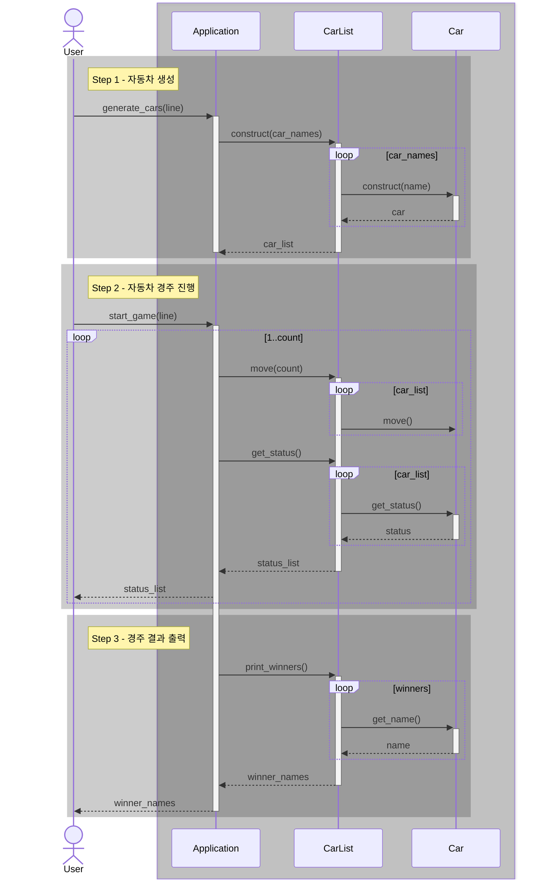

# java-racingcar-precourse

## System Sequence

## Domain

### Car

- [ ] 5자 이하의 이름을 가짐
- [ ] 확률적으로 성공하는 전진 기능
- [ ] 다른 자동차와 전진 거리를 기준으로 비교 기능
- [ ] 정보 출력 기능

## Flow

### 자동차 생성

- [ ] 입력(line)을 파싱하여 자동차 이름 목록 생성
- [ ] 자동차 이름 목록으로 자동차 목록 생성

### 자동차 경주 진행

- [ ] 입력(line)을 받아 이동 횟수 생성
- [ ] 이동 횟수만큼 자동차 목록에 전진, 정보 출력 수행

### 경주 결과 출력

- [ ] 우승 자동차 목록 계산
- [ ] 우승 자동차 목록 출력
