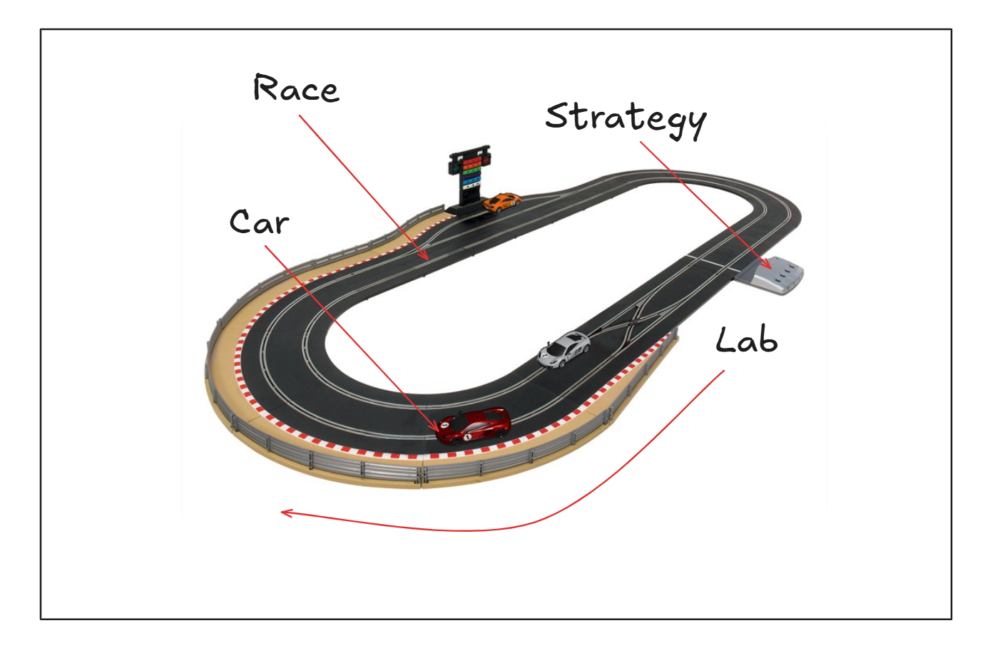

# 자동차 경주

## 구조도

## 기능 목록

### 1. 입력 처리

- **자동차 이름 입력**
    - [x] 경주할 자동차의 이름들을 입력받는다.
    - [x] 입력이 null이거나 빈 문자열일 경우 `IllegalArgumentException`을 발생시킨다.

- **시도 횟수 입력**
    - [x] 경주를 몇 번 진행할 것인지를 입력받는다.
    - [x] 입력이 null이거나 빈 문자열일 경우 `IllegalArgumentException`을 발생시킨다.

### 2. 자동차 경주 진행

- **자동차 설정**
    - [x] 입력된 자동차 이름이 5자를 초과할 경우 `IllegalArgumentException`를 발생시킨다.
    - [x] 입력된 시도 횟수가 양수가 아닐 경우 `IllegalArgumentException`를 발생시킨다.

- **자동차 경주 진행**
    - [x] 각 시도마다 모든 자동차를 대상으로 랜덤 값이 4 이상일 경우 자동차는 전진하고, 그렇지 않으면 멈춘다.
    - [x] 주어진 횟수만큼 자동차들이 경주를 진행한다.

- **경주 우승자 결정**
    - [x] 경주가 끝난 후 가장 멀리 간 자동차가 우승자가 된다.

### 3. 출력 처리

- **경주 결과 출력**
    - [x] 각 시도 결과마다 각 자동차의 이름과 현재 위치를 출력한다.
    - [x] 자동차의 위치는 '-'로 표시된다.

- **우승자 출력**
    - [x] 경주가 끝난 후 최종 우승자를 출력한다.
    - [x] '최종 우승자 : (우승자1, 우승자2, ...)' 형식으로 출력한다.

## 주요 내용

- **책임 분리**
    - controller는 view와 model을 연결하는 역할만을 수행한다.
        - 유연한 구조를 위해 view와 model을 직접 참조하지 않고, 인터페이스를 통해 의존성을 주입한다.
    - model은 비지니스 로직을 담당하고 있다.
        - Race 클래스는 자동차 경주를 진행하는 역할을 수행한다. 한 번의 시도에서 이동 전략에 따라 자동차의 위치를 변경한다.
        - Car 클래스는 자동차의 이름과 위치를 저장하고, 이동 할 수 있다.
        - Lap 클래스는 한 번의 시도를 나타낸다.
    - view는 사용자의 입력을 받아 controller에게 전달하고, controller로부터 결과를 받아 출력한다.
        - main 함수는 view와 controller를 생성하고, controller의 메소드를 호출하여 프로그램을 실행한다.
            - 변경 가능성이 많으므로 최대한 멍청하게 구성한다.

- **책임 검증**
    - controller는 역할을 의존하며 기능을 호출하는 책임만을 가졌기 때문에 통합 테스트만으로 충분하다고 생각하여 단위 테스트를 작성하지 않았다.
    - view는 언제든 변경될 수 있는 부분이기 때문에 통합 테스트만으로 충분하다고 생각하여 단위 테스트를 작성하지 않았다.
    - model은 비지니스 로직을 담당하고 있는 부분이기 때문에 오류 발견을 위해 단위 테스트를 작성하였다.

- **예외 처리**
    - 프로그램 요구사항이 복잡하지 않고 각 클래스에서 예외를 던지기만 하기 때문에 enum으로 구성하지 않았다.
