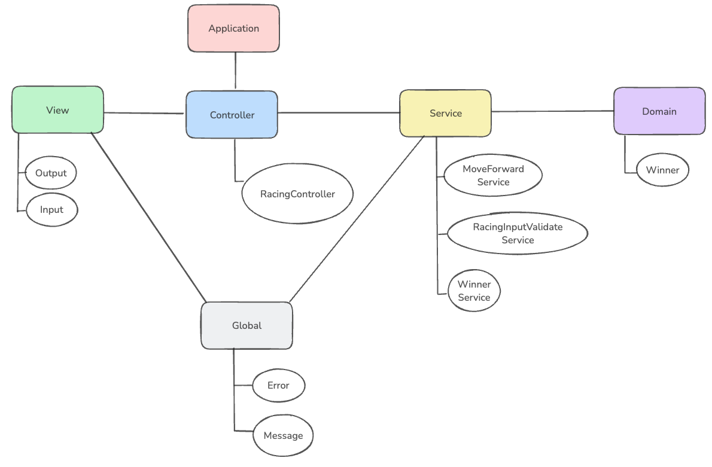

# 자동차 경주 🚗🏁

## 기능 설명

1. **자동차 전진 및 멈춤**
    - 주어진 횟수 동안 n대의 자동차는 전진하거나 멈출 수 있습니다. 전진하는 조건은 무작위 값이 4 이상일 경우입니다.

2. **자동차 이름 설정**
    - 각 자동차에 이름을 부여할 수 있으며, 전진하는 자동차를 출력할 때 이름을 같이 출력합니다. 자동차 이름은 쉼표(`,`)로 구분하며, 5자 이하만 가능합니다.

3. **이동 횟수 입력**
    - 사용자는 자동차들이 몇 번 이동할 것인지를 입력할 수 있습니다.

4. **우승자 결정**
    - 자동차 경주가 끝난 후, 누가 우승했는지 알려줍니다. 우승자는 한 명 이상일 수 있으며, 여러 명일 경우 쉼표(`,`)로 구분됩니다.

5. **잘못된 입력 처리**
    - 사용자가 잘못된 값을 입력할 경우 `IllegalArgumentException`을 발생시키고, 애플리케이션은 종료됩니다.

## 예시

**입력**
- 경주할 자동차 이름 (이름은 쉼표(,) 기준으로 구분):
    - `pobi,woni,jun`
- 시도할 횟수:
    - `5`

**출력**
- 차수별 실행 결과:
    - pobi : `--`
    - woni : `----`
    - jun : `---`

---

## 프로젝트 구조

---

## 기본적인 고려사항 💻

1. **자동차 이름을 `,`을 이용해 split하여 분할**
    - `car1,car2,car3`을 입력 할 시 `car1`,`car2`,`car3`이다.

2. **자동차 이름에 null값이나 빈칸이 있는지 검증**
    - `car1,,car2`을 입력 할 시 빈칸이있어 오류 발생

3. **자동차 이름의 길이가 `5` 이하**
    - `car1,racingcar,car3`을 `racingcar`때문에 오류

4. **시도 횟수는 양의 정수**
    - `1.3`을 입력 할 시 실수를 입력했음으로 오류

5. **랜덤 횟수에 따라 자동차들의 전진 횟수 업데이트**
    - `car1 1`이 전진을 한다면 `car1 2`로 업데이트

6. **자동차들의 전진 기록들을 출력**
    - `car1 1`,`car2 2`이면 `car1: -`, `car2: --`

7. **가장 많이 전진한 자동차 출력**
    - `car1 1`,`car2 2`이면 `car1` 출력 🏆

## 추가적으로 고려해야 할 사항 🔥

1. **자동차 이름이 중복되면 안됨**
    - `car1,car1,car2`을 입력 할 시 `중복`이다.