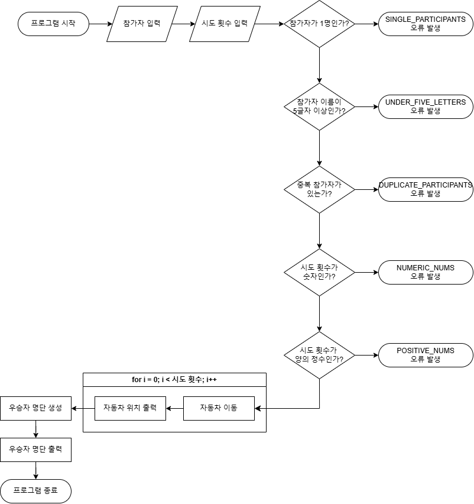

# 과제 설명
## 기능 요구사항
- [X] 참가자 명단 및 시도 횟수 입력
- [X] 참가자 명단 파싱
- [X] 시도 횟수 파싱
- [X] 명단 유효성 검증
- [X] 시도 횟수 유효성 검증
- [X] 경기 진행
  - [X] 참가자 자동차 생성
  - [X] 경기 진행 및 종료 여부 확인 (n번)
- [X] 경기 결과 출력

## 예외 상황
- 참가자 명단 유효성 검증 실패시 예외 발생 (IllegalArgumentException)
  - 이름이 5글자 초과인 경우
  - 중복된 이름이 있는 경우
  - 참가자의 수가 1명 이하인 경우
- 시도 횟수 유효성 검증 실패시 예외 발생 (IllegalArgumentException)
  - 시도 횟수가 양의 정수가 아닌 경우

## 테스트
### 정상 입력 테스트
```text
pobi,woni
1
```
```text
pobi,woni
2
```
```text
pobi,woni
3
```
```text
pobi,woni,bha, kaeri
5
```
```text
pobi,woni,, bha, kaeri
5
```

### 비정상 입력 테스트
```text
pobi
4
```
```text
pobi,wonini
3
```
```text
pobi,pobi
4
```

## 순서도


## 프로젝트 구조
```text
│
└─src
    ├─main
    │  └─java
    │      ├─controller
    │      │      RaceController.java
    │      │
    │      ├─exception
    │      │      GameException.java
    │      │
    │      ├─model
    │      │      Car.java
    │      │      Race.java
    │      │      RaceInput.java
    │      │
    │      ├─racingcar
    │      │      Application.java
    │      │
    │      ├─service
    │      │      MoveStrategy.java
    │      │
    │      ├─util
    │      │      InputParser.java
    │      │
    │      ├─validator
    │      │      InputValidator.java
    │      │
    │      └─view
    │              InputView.java
    │              OutputView.java
    │
    └─test
        └─java
            └─racingcar
                    ApplicationTest.java
```