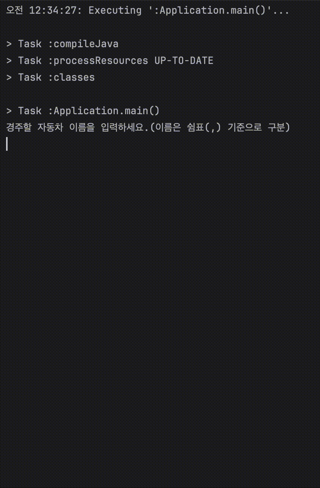

<p align="center">
    
</p>

# 프리코스 2주차 미션 - 자동차 경주

---


> 우아한테크코스 7기 프리코스 2주차 미션, 자동차 경주를 구현한 저장소입니다.

<br>



# 목차

- ### [기능 요구 사항](#기능-요구-사항)
- ### [자체 구현 사항](#자체-구현-사항)
- ### [동작 흐름](#동작-흐름)
- ### [기능 목록](#기능-목록)
  - #### [입력 처리](#1입력-처리)
  - #### [로직 구현](#2-로직-구현)
  - #### [출력 처리](#3-출력-처리)
  - #### [예외 처리](#4-예외-처리)
  - #### [테스트](#5-테스트)

---

## 기능 요구 사항

- #### 주어진 횟수 동안 n대의 자동차는 전진 또는 멈출 수 있다.
- #### 각 자동차에 이름을 부여할 수 있다. 전진하는 자동차를 출력할 때 자동차 이름을 같이 출력한다.
- #### 자동차 이름은 쉼표(,)를 기준으로 구분하며 이름은 5자 이하만 가능하다.
- #### 사용자는 몇 번의 이동을 할 것인지를 입력할 수 있어야 한다.
- #### 전진하는 조건은 0에서 9 사이에서 무작위 값을 구한 후 무작위 값이 4 이상일 경우이다.
- #### 자동차 경주 게임을 완료한 후 누가 우승했는지를 알려준다. 우승자는 한 명 이상일 수 있다.
- #### 우승자가 여러 명일 경우 쉼표(,)를 이용하여 구분한다.
- #### 사용자가 잘못된 값을 입력할 경우 IllegalArgumentException 을 발생시킨 후 애플리케이션은 종료되어야 한다.

---

## 자체 구현 사항

- #### 자동차 이름 또는 Lap 이 Empty or Blank 이면 오류메시지 출력
- #### 자동차 이름이 중복되면 오류메시지 출력

---

## 동작 흐름

- `경주할 자동차 이름을 입력하세요.(이름은 쉼표(,) 기준으로 구분)`가 콘솔에 출력된다.
- 쉼표를 기준으로 자동차 이름들을 입력 받는다.
- `시도할 횟수는 몇 회인가요?`가 콘솔에 출력된다.
- 시도할 횟수를 양수로 입력받는다.
- 차수별 실행 결과가 콘솔에 출력된다.
  - ```
    pobi : -
    woni :
    jun : -
    
    pobi : --
    woni : -
    jun : --
  
    pobi : ---
    woni : --
    jun : ---
    
    pobi : ----
    woni : ---
    jun : ----
    
    pobi : -----
    woni : ----
    jun : -----
    ```
- 결과에 따른 우승자를 콘솔에 출력한다.
  - 단독 우승자일 경우: `최종 우승자 : pobi`
  - 공동 우승자일 경우: `최종 우승자 : pobi, jun`

---

## 기능 목록

### 1.입력 처리

- **기능**: 사용자로부터 자동차 이름 입력받기
  - **입력 형식**: String
  - **유효성 검사**: 
    - 공백이나 null 을 입력받을 경우 오류메시지 출력
    - 중복된 값을 입력받을 경우 오류메시지 출력


- **기능**: 사용자로부터 횟수 입력받기
  - **입력 형식**: int
  - **유효성 검사**: 
    - 0 또는 음수를 입력받을 경우 오류메시지 출력
    - 공백이나 null 을 입력받을 경우 오류메시지 출력

### 2. 로직 구현

- **메서드**: isValidLength()
- `알고리즘`: 입력받은 자동차 이름 중 '5글자' 초과하는지 검사
  - 글자 수는 상수로 관리


- **메서드**: isNameDuplicate()
- `알고리즘`: 입력된 이름들이 중복되는지 검사


- **메서드**: isValidPositiveNumber()
- `알고리즘`: 입력받은 숫자가 양수인지 검사


- **메서드**: getCarMovementActionByRandomValue()
- `알고리즘`: 무작위 값이 4 이상인지 판단
  - 제공되는 Random() 함수 사용
  - 4 이상이면 '전진' / 4 미만이면 '정지'
  - 전진과 정지는 상수로 관리


- **메서드**: findCarWithMaxForwardMoves()
- `알고리즘`: 가장 많이 전진한 자동차 찾기
  - 반환값은 자동차의 이름 
  - 결과값이 2개 이상일 수 있음


### 3. 출력 처리


- **메서드**: displayChampion()
- **출력 형식**: `최종 우승자 : 자동차 이름(들)`


- **메서드**: displayResultsByLap()
- **출력 형식**: `자동차 이름 : - * 전진횟수` 자동차 개수만큼 줄바꿈

### 4. 예외 처리

- **기능**: 잘못된 입력 처리
  - **오류 메시지**: `IllegalArgumentException`

### 5. 테스트

- **기능**: 테스트 케이스 작성(랜덤값에 의해 결과가 바뀌기 때문에 예외처리 테스트만 진행)
  - **자동차 이름 입력 케이스** 
    - **케이스 1**: `"666666,1,22" => 오류메시지 출력`
    - **케이스 2**: `"55555,,22" => 오류메시지 출력`
    - **케이스 3**: `"55555, ,22" => 오류메시지 출력`
    - **케이스 4**: `"55555,22,22" => 오류메시지 출력`
  
  - **횟수 입력 케이스**
    - **케이스 1**: `"-1" => 오류메시지 출력`
    - **케이스 2**: `"0" => 오류메시지 출력`
    - **케이스 3**: `"" => 오류메시지 출력`
    - **케이스 4**: `" " => 오류메시지 출력`
  
