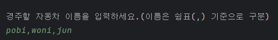
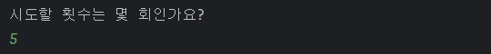
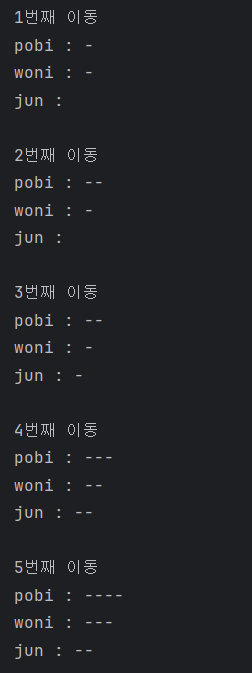
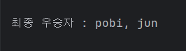
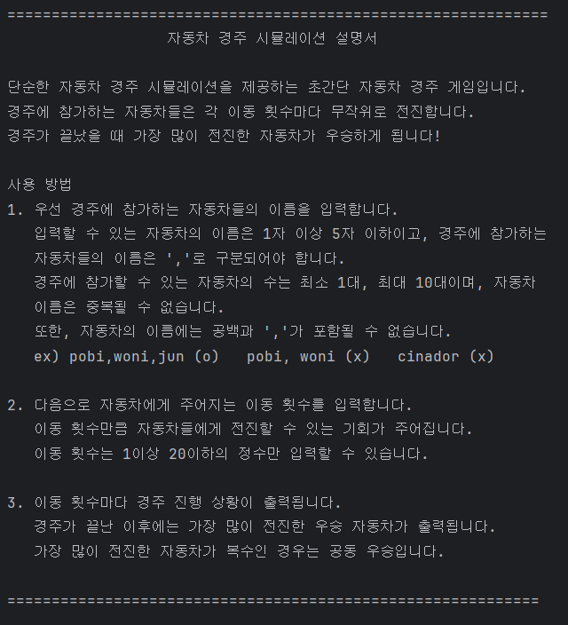

# 🚗 우테코 프리코스 2주차 - 자동차 경주


## 🔍목차

1. [개요](#1-개요)
2. [주요 기능](#2-주요-기능)
3. [설치 및 시작하기](#3-설치-및-시작하기)
4. [프로젝트 구조](#4-프로젝트-구조)
5. [구현 기능 목록](#5-구현-기능-목록)

## 1. 개요

### Team

- 윤상민

### Project Summary

단순한 자동차 경주 시뮬레이션을 제공하는 초간단 자동차 경주 게임입니다.
경주에 참가하는 자동차들과 이동 횟수를 입력받아서 경주를 세팅하고, 경주 결과를 출력해주는 프로그램입니다.
<br><br>

## 2. 주요 기능

- **경주에 참가하는 자동차들의 이름을 입력받습니다.**

  <br><br>

  경주에 참가하는 자동차들의 이름을 ','로 구분될 수 있게끔 입력받습니다. <br>
  이 때, 입력할 수 있는 자동차의 이름은 1자 이상 5자 이하이고, 이름에 공백이나 ','가 포함될 수 없습니다. <br>
  또한, 경주에 참여할 수 있는 자동차는 1대 이상 10대 이하이며, 이름이 중복될 수 없습니다.
  <br><br><br>

- **자동차들의 이동 횟수를 입력받습니다.**<br><br>

  <br><br>

  자동차가 전진할 수 있는 이동 횟수를 입력받습니다.<br>
  자동차는 각 이동 횟수마다 무작위로 전진합니다.
  입력할 수 있는 이동 횟수는 1이상 20이하의 정수입니다.
  <br><br><br>

- **각 이동 횟수마다 경주 진행 상황이 출력됩니다.**<br><br>

  <br><br>

  각 이동 횟수마다 경주에 참여한 자동차들의 전진한 거리가 출력됩니다.
  <br><br><br>

- **경주 결과로 가장 많이 전진한 우승 자동차를 출력합니다.**<br><br>

  

  경주가 끝나고 가장 많이 전진한 자동차가 우승합니다. 위 예시에서는 4번으로 가장 많이 전진한 pobi가 우승입니다. <br><br>
  만약 전진한 횟수가 가장 많은 자동차가 복수라면 공동 우승입니다.<br><br>
  
  <br><br><br>

- **프로그램을 실행할 시에 사용자에게 위 기능을 설명하는 설명서를 제공합니다.**<br><br>

  

## 3. 설치 및 시작하기

#### Prerequisite

- **Java**
- **Gradle** build tool

<br>
레포지토리를 clone하고 IntelliJ IDEA, Eclipse 등의 IDE에서 src/main/java에 있는 Application.java를 실행합니다.

```conventionalcommit
$ git clone https://github.com/cinador/java-racingcar-7.git
```

## 4. 프로젝트 구조

```conventionalcommit
📦src
 ┣ 📂main
 ┃ ┗ 📂java
 ┃ ┃ ┗ 📂racingcar
 ┃ ┃ ┃ ┣ 📂controller
 ┃ ┃ ┃ ┃ ┗ 📜RacingController.java
 ┃ ┃ ┃ ┣ 📂model
 ┃ ┃ ┃ ┃ ┣ 📂dto
 ┃ ┃ ┃ ┃ ┃ ┗ 📜Car.java
 ┃ ┃ ┃ ┃ ┗ 📜RaceStatus.java
 ┃ ┃ ┃ ┣ 📂service
 ┃ ┃ ┃ ┃ ┣ 📜RacingService.java
 ┃ ┃ ┃ ┃ ┣ 📜ResultService.java
 ┃ ┃ ┃ ┃ ┗ 📜SetUpService.java
 ┃ ┃ ┃ ┣ 📂view
 ┃ ┃ ┃ ┃ ┗ 📜RacingView.java
 ┃ ┃ ┃ ┗ 📜Application.java
 ┗ 📂test
 ┃ ┗ 📂java
 ┃ ┃ ┗ 📂racingcar
 ┃ ┃ ┃ ┣ 📂controller
 ┃ ┃ ┃ ┃ ┗ 📜RacingControllerTest.java
 ┃ ┃ ┃ ┣ 📂service
 ┃ ┃ ┃ ┃ ┣ 📜RacingServiceTest.java
 ┃ ┃ ┃ ┃ ┣ 📜ResultServiceTest.java
 ┃ ┃ ┃ ┃ ┗ 📜SetUpServiceTest.java
 ┃ ┃ ┃ ┗ 📜ApplicationTest.java
```

## 5. 구현 기능 목록

- 자동차의 이름과 전진한 거리를 저장, 자동차 이름 예외처리 : model.RaceStatus, model.dto.Car


- 입력으로 받은 정보를 가지고 자동차 경주를 세팅, 자동차 수 예외처리 : service.SetUpService


- 자동차 경주를 진행 : service.RacingService


- 자동차 경주의 우승 자동차를 선정 : service.ResultService


- 사용자와의 상호작용, 입출력 기능 : view.RacingView


- View와 Service/Model을 연결, 시도 횟수 예외처리 : controller.RacingController
