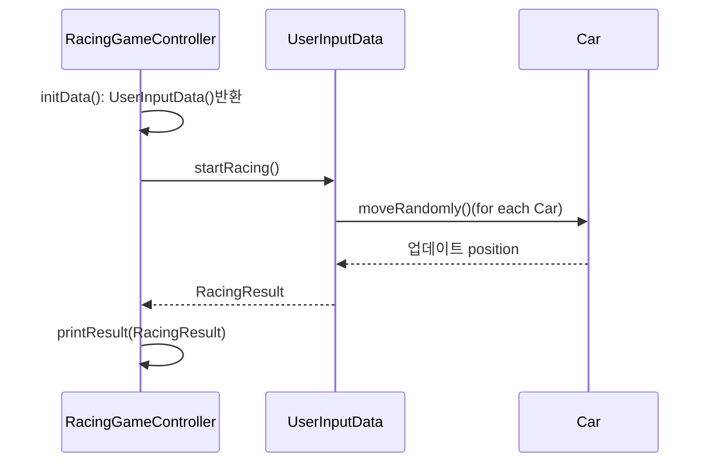

    

# 프리코스 2주차 미션 - 자동차 경주

---

##  💪 미션 개요
1. 경주할 자동차 이름과, 시도횟수를 입력받는다.
2. 자동차들은 시도 회차마다 전진을 시도한다.(일정확률로 전진)
2. 차수별로 실행 결과를 출력한다.
3. 최종 우승자를 출력한다.

# 📝기능 목록

- [x] 경주할 자동차 이름을 입력 받는 기능
    - `출력문구`: "경주할 자동차 이름을 입력하세요.(이름은 쉼표(,) 기준으로 구분)"
    - [x] 입력받은 이름들을 쉼표(,) 기준으로 구분하는 기능.  

- [x] 시도 횟수를 입력 받는 기능
  - `출력문구`: "시도할 횟수는 몇 회인가요?"  
  
- [x] 자동차 전진하는 기능
  - [x] 0에서 9 사이의 난수를 뽑아 4이상을 체크하는 기능  

- [x] 시도 회차 별로 실행 결과 출력 기능
    - `출력예시` 
      실행 결과 
      pobi : - 
      woni : 
      jun : -  

- [x] 최종 우승자를 출력 기능
  - `출력예시`: "최종 우승자 : pobi"
  - `출력예시(2)`: (공동우승자인경우) "최종 우승자 : pobi, jun" 
  - [x] 최종 우승자를 추출하는 기능  

## ⚡예외 발생 사안
`사용자가 잘못된 값을 입력할 경우 IllegalArgumentException을 발생시킨 후 애플리케이션은 종료되어야 한다.`

- 경주할 자동차 이름을 입력 받는 기능
- [x] 예외처리: 빈값을 입력한 경우 
- [x] 예외처리: 이름이 5자 초과한 경우
- [x] 예외처리: 알파벳,숫자와 언더바(_)이외의 문자를 이름으로 한 경우(공백포함)  

- [x] 시도 횟수를 입력 받는 기능
- [x] 예외처리: 0또는 빈값을 입력한 경우
- [x] 예외처리: 숫자가 아닌값 입력한 경우

## 🙋‍♂️스스로 판단해본 기능 요구 사항
- 입력된 이름들을 분리할때 ", " 로 구분된경우 이름 앞에 공백 삭제하여 이름초기화할것.
- 이름은 알파벳,숫자와 언더바(_)만 가능
- 시도횟수입력으로 0은 불가능하다.

---
## 시퀀스다이어그램

