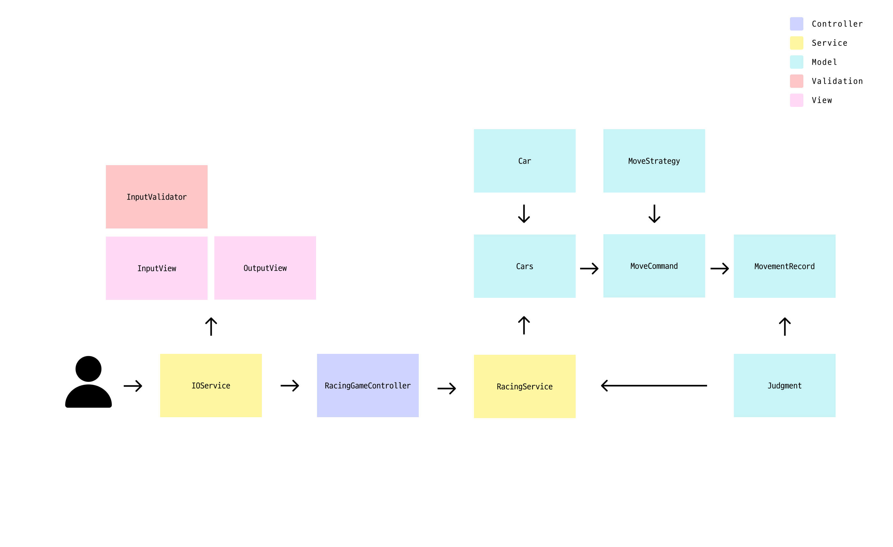

# java-racingcar-precourse

## 문제 설명

초간단 자동차 경주 게임을 구현한다.

- 주어진 횟수 동안 n대의 자동차는 전진 또는 멈출 수 있다.
- 각 자동차에 이름을 부여할 수 있다. 전진하는 자동차를 출력할 때 자동차 이름을 같이 출력한다.
- 자동차 이름은 쉼표(,)를 기준으로 구분하며 이름은 5자 이하만 가능하다.
- 사용자는 몇 번의 이동을 할 것인지를 입력할 수 있어야 한다.
- 전진하는 조건은 0에서 9 사이에서 **무작위 값**을 구한 후 무작위 값이 4 이상일 경우이다.
- 자동차 경주 게임을 완료한 후 누가 우승했는지를 알려준다. 우승자는 한 명 이상일 수 있다.
- 우승자가 여러 명일 경우 쉼표(,)를 이용하여 구분한다.
- 사용자가 잘못된 값을 입력할 경우 `IllegalArgumentException`을 발생시킨 후 애플리케이션은 종료되어야 한다.

## 실행 결과 예시

```shell
경주할 자동차 이름을 입력하세요.(이름은 쉼표(,) 기준으로 구분)
pobi,woni,jun
시도할 횟수는 몇 회인가요?
5

실행 결과
pobi : -
woni : 
jun : -

pobi : --
woni : -
jun : --

pobi : ---
woni : --
jun : ---

pobi : ----
woni : ---
jun : ----

pobi : -----
woni : ----
jun : -----

최종 우승자 : pobi, jun
```

## 구현 기능 목록

### 입력 관련

- **사용자 입력**
    - [x]  자동차 이름 입력
    - [x]  시도할 횟수 입력
- **입력 검증**
    - **[ 예외 상황 ]**
        - **이름**
            - [x] 아무것도 입력하지 않았을 경우
            - [x] 이름이 5자를 초과할 때 ex) pobibi
            - [x] 이름이 영어로 이루어져 있지 않을 경우 ex) 우테코
            - [x] 중복되는 이름이 입력되었을 경우 ex) pobi,pobi 
        - **횟수**
            - [x] 아무것도 입력하지 않았을 경우
            - [x] 숫자가 아닌 값을 입력했을 경우 ex) a
            - [x] 시도할 횟수가 범위(1 ~ 10)를 벗어났을 경우 ex) 11, -1

### 게임 관련

- **자동차**
    - [x] 자동차 객체 생성
    - [x] 각 자동차에 이름과 초기 상태 부여
- **자동차 상태 관리**
    - [x] 자동차의 현재 위치 상태를 업데이트
    - [x] 이동 결과 객체에 기록
- **이동 규칙**
    - [x] 이동 규칙 정의
    - [x] 랜덤 값 반환 객체 생성
- **이동 명령**
    - [x] 규칙에 따라 자동차의 이동 방법 결정 (전진, 정지)
    - [x] 진행자가 각 자동차에 이동 명령

### 결과 관련

- **우승자 판단**
    - [x] 각 자동차의 최종 위치를 기준으로 우승자 판단
    - [x] 여러 대의 자동차가 동시에 우승할 수 있는 경우 처리
- **최종 결과 출력**
    - [x] 각 라운드 실행 과정 출력
    - [x] 우승자 출력

## 게임 규칙

### 이름
- 5자 이하여야 합니다.
- 영어로만 이루어져야 합니다.
- 중복된 이름은 사용할 수 없습니다.
- 이름은 쉼표로 구분됩니다.
### 시도 횟수
- 숫자만 입력할 수 있습니다.
- 1부터 10까지만 입력할 수 있습니다.

## 역할

### Car
이름과 위치를 관리하고 이동하는 책임을 가지고 있습니다.
### Cars
이동 명령에 특정 자동차의 위치를 업데이트하며, 모든 자동차의 상태를 조회하고 관리합니다.
### RandomMoveStrategy
게임의 규칙을 알고 있습니다. `RandomNumberGenerator`로 무작위 값을 생성하고, 이 값이 특정 임계값 이상일 경우 이동 가능성을 판단합니다.
### MoveCommand
규칙에 해당하는 자동차(들)에게 이동을 명령합니다.
### MovementRecord
각 라운드의 자동차 위치 기록을 관리합니다.
### Judgment
기록을 바탕으로 최종 라운드의 우승자를 결정합니다.
### InputView/OutputView
필요한 입력값을 처리하고 실행 결과와 우승자를 출력합니다.
### IOService/RacingService
필요한 객체와 협력하여 IOService는 입력 검증 및 출력 처리, RacingService는 게임 로직 처리를 담당합니다.
### RacingGameController
사용자와의 상호작용을 담당합니다.

## 흐름


## 디렉토리 구조
```shell
├── Application.java
├── controller
│   └── RacingGameController.java
├── model
│   ├── Car.java
│   ├── Cars.java
│   ├── Judgment.java
│   ├── MoveCommand.java
│   ├── MoveStrategy.java
│   ├── MovementRecord.java
│   └── RandomMoveStrategy.java
├── service
│   ├── IOService.java
│   └── RacingService.java
├── util
│   └── RandomNumberGenerator.java
├── validation
│   └── InputValidator.java
└── view
    ├── InputView.java
    └── OutputView.java
```