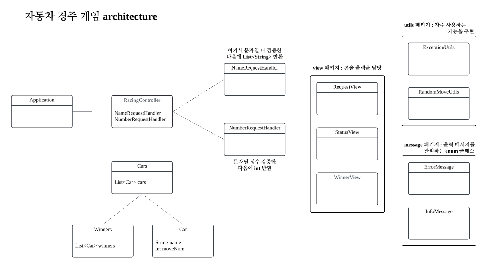

# java-racingcar-precourse

## 요구사항

- 사용자가 입력한 이동 횟수동안 n대의 자동차는 전진 또는 정지만 할 수 있다.
- 자동차의 이름은 쉼표`,`를 기준으로 구분하며 각 자동차의 이름은 5자 이하만 가능하다.
- 매 이동마다 현황이나 최종 결과를 출력할 때, 자동차 이름도 함께 출력해야 한다.
- 전진 조건 : 0에서 9 사이에서 무작위 값을 구한 후 무작위 값이 4 이상일 경우
- 우승자는 한 명 이상일 수 있고, 우승자가 여러 명인 경우 쉼표`,`를 사용하여 구분한다.
- 예외 상황이 발생하면 에러 메시지를 출력한 후, `IllegalArgumentException`을 발생시킨다.

## 추가로 정의한 요구사항

- 자동차 이름 목록에 띄어쓰기는 포함될 수 없다.
- 자동차 이름에는 숫자나 쉼표를 제외한 특수문자가 포함될 수 있다.
- 이동 횟수는 0 이상이어야 한다.

# 🏎 자동차 경주 게임 Todo List

> **코드를 구현하며 이동 횟수가 0인 경우 따로 처리할 부분이 있는지 검증하기!**

### 1. 자동차 이름과 이동 횟수를 입력받는 기능

- [x] 자동차의 이름 목록 입력을 요청하는 메시지를 출력한다.
- [x] 자동차 이름을 입력한다.
    - [x] 빈 문자열인지 검사한다.
    - [x] 띄어쓰기가 포함되어 있는지 확인한다.
    - [x] 쉼표를 구분자로 하여 문자열을 분리한다.
    - [x] 분리한 각 문자열이 5자 이하인지 확인한다.
- [x] 이동 시도 횟수 입력을 요청하는 메시지를 출력한다.
- [x] 이동 시도 횟수를 입력한다.
    - [x] 빈 문자열인지 검사한다.
    - [x] 0 또는 양의 정수인지 검사한다.
    - [x] 범위를 넘어가지 않는지 확인한다. (양수 오버플로우 발생시 음수가 되므로 위의 경우에서 검증된다.)

### 2. 이동 횟수만큼 (랜덤 정수를 추출하고, 이를 통해 이동/멈춤을 정한다) 를 반복하는 기능

- [x] `Randoms.pickNumberInRange()` 메서드를 사용하여 0에서 9 사이의 무작위 정수를 구한다.
- [x] 무작위 값이 4 이상인 경우 true를, 아닌 경우 false를 반환한다.
- [x] 반환한 boolean 값이 true면 1회 전진 처리를 해준다.
- [x] 반복문을 통해 위의 과정을 이동 횟수만큼 수행한다.
- [x] 모든 차들에 대해서 이동/멈춤을 정했으면, 현재 경주 현황을 출력한다.
    - [x] 각 자동차들에 대해 자신의 이름과 지금까지 이동한 총 횟수만큼 연속된 `-` 문자열을 출력한다.

### 3. 최종 승자를 선택하여 출력하는 기능

- [x] 자동차들의 총 이동 횟수를 비교하며 최대 이동 횟수를 찾는다.
- [x] 최대 이동 횟수만큼 이동한 자동차들을 winner로 추가한다.
- [x] `String.join()`메서드를 사용해서 우승자 목록을 쉼표로 구분하여 출력한다.

# 자동차 경주 게임 architecture

