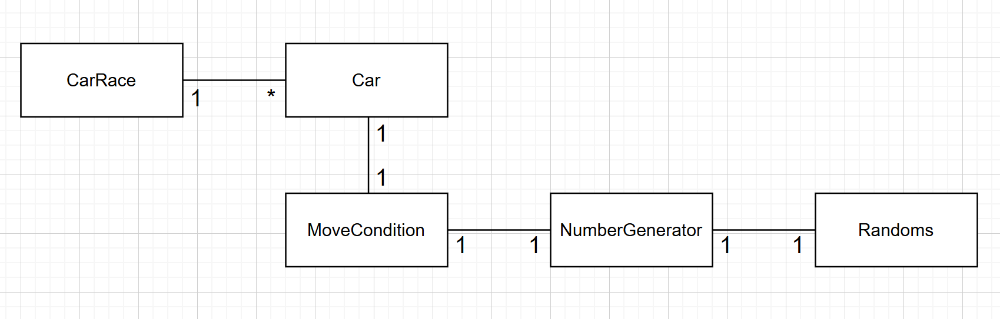
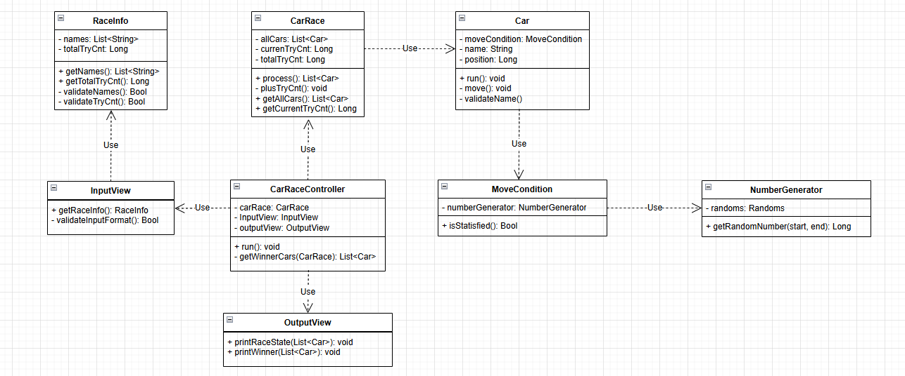

# java-racingcar-precourse

## 객체 모델링

## 클래스 다이어그램

## 기능구현목록

---
### MODEL
#### CarRace
- [x] 시도 횟수가 남았는지 판단한다.
- [x] 각 자동차를 동작시킨다.
- [x] 레이스에 참여한 자동차를 알려준다.
#### Car
- [x] 자동차 이름을 검증한다.
  - 자동차 이름이 공백인 경우 에러
  - 자동차 이름의 글자수가 6이상인 경우 에러
- [x] 조건에 따라, 현재 위치를 한 칸 움직인다.
#### MoveCondition
- [x] 조건이 만족되는지 판단한다.
#### NumberGenerator
- [x] 랜덤 숫자를 생성한다.
#### RaceInfo
- [x] 자동차 이름을 검증한다.
  - 자동차 이름이 공백인 경우 에러
  - 자동차들간 이름이 중복이 발생한 에러
- [x] 총 시도 횟수를 검증한다.

---
## VIEW
#### InputView
- [x] 사용자로부터 레이스 정보를 전달받는다.

#### OutputView
- [x] 입력 안내문을 출력한다.
- [x] 레이스의 진행상태를 출력한다.
- [x] 레이스의 우승자를 출력한다.

---
##  Controller
#### CarRaceController
-  [x] 사용자로부터 입력을 받을 수 있도록 제어한다.
-  [x] 총 시도횟수 만큼 레이스를 진행한다.
-  [x] 레이스가 종료 된 후, 우승자를 계산한다. 
---