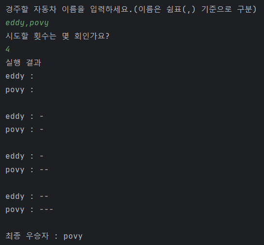
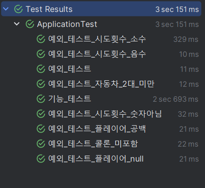

# 프리코스 2주차 미션 - 자동차 경주

## 미션 목표 

> 초간단 자동차 경주 게임을 구현한다.

## 사용 예시 



## 기능 목록 

- [x] 게임의 입출력 틀 구현하기
    - [x] 사용자로부터 문자열 입력받기 - 경주할 자동차 이름, 시도 횟수
    - [x] 결과 출력하기 - 차수별 실행 결과, 우승자 안내 문구
    - [x] 자동차 이름 쉼표(,)를 기준으로 구분하기
- [x] 자동차 움직이기
    - [x] 각각의 자동차 별로 한 번의 시행마다 무작위 값 구하기
    - [x] 무작위 값이 4이상일 경우 : 전진하기
    - [x] 무작위 값이 4미만일 경우 : 멈추기
- [x] 예외 처리하기 - IllegalArgumentException 발생시킨 후 애플리케이션 종료
    - [x] 경주할 자동차 입력을 잘못한 경우
        - [x] 경주하는 자동차의 수가 2대 미만인 경우
        - [x] 자동차 이름이 5자 이상인 경우
        - [x] 플레이어 입력 값이 공백 or null일 경우
        - [x] 구분자가 쉼표(,)가 없을 경우
    - [x] 시도할 횟수 입력을 잘못한 경우
        - [x] 시도횟수 입력 값이 음수인 경우
        - [x] 시도횟수 입력 값이 소수인 경우
        - [x] 숫자가 아닌 것(문자, 특수문자, 공백, null)를 입력할 경우

## 사고 흐름 및 개발 과정

시스템의 책임 : **자동차 경주 게임을 구현하는 것**

책임을 더 작게 분할하면 다음과 같다.
- 사용자로부터 경주할 자동차의 이름과 시도횟수를 입력받는다.
- 자동차 경주 게임을 진행한다.
- 우승자를 출력한다.

어떤 객체가 필요할까?
- 입력을 처리하는 입력 객체 InputView
- 출력을 처리하는 출력 객체 OutputView
- 자동차 객체 CarPlayer
- 에러 메시지를 저장하는 객체 ErrorMessage
- 기타 상수를 저장하는 객체 Constant
- 자동차 경주 게임로직을 담당하는 객체 RacingGameController
- 검증 기능을 수행하는 검증 객체 Validation
- 각 라운드의 결과를 기록할 객체 RoundRecord (추가)

각 객체에게 책임을 할당하면 다음과 같다.
- 사용자 -> (입력을 받아라) -> 입력 객체
- 입력 객체 -> (값을 기반으로 게임을 진행하라) -> 게임 로직 담당 객체
- 게임 로직 담당 객체 -> (우승자를 출력하라) -> 출력 객체

## 프로젝트 구조

```text
C:\USERS\SIYUN\JAVA-RACINGCAR-7\SRC
├───main
│   └───java
│       └───racingcar
│           │   Application.java
│           │
│           ├───constant
│           │       Constant.java
│           │       ErrorMessage.java
│           │
│           ├───controller
│           │       RacingGameController.java
│           │
│           ├───model
│           │       CarPlayer.java
│           │       RoundRecord.java
│           │
│           ├───util
│           │       Validation.java
│           │
│           └───view
│                   InputView.java
│                   OutputView.java
│
└───test
    └───java
        └───racingcar
                ApplicationTest.java
```

## 객체의 협력, 역할, 책임


## 기타 요구사항 목록 

- [x] JDK 21 버전임을 확인하기
- [x] 자바 코드 컨벤션을 지키면서 코드 구현하기
- [x] README.md에 정리한 기능 목록을 기반으로 커밋하기
- [x] AngularJS Git 커밋 메시지 컨벤션을 지키면서 커밋 메시지 작성하기
- [x] 제공된 Console API를 사용하여 구현하기
- [x] indent의 depth가 3이 넘지 않도록 구현하기
- [x] 3항 연산자를 쓰지 않고 코드 작성하기
- [x] 함수가 한 가지 일만 하도록 최대한 작게 만들기
- [x] JUnit 5와 AssertJ를 이용, 테스트 코드로 확인하며 기능 점검하기

## 코드 작성 시 숙지 사항

- [x] 요구사항을 모두 충족했는지
- [x] git의 기능 학습과 관리해야 할 자원을 고려하기
- [x] 의미있는 커밋 메시지를 작성하기
- [x] 디버거 사용 방법 숙지하기
- [x] 코드 작성 가이드
    - 변수, 함수, 클래스의 역할에 대한 의도를 함축하는 이름 짓기
        - 이름을 지을 때 축약하지 않기 (한 두단어로 유지, 문맥 중복x)
    - 문맥을 분리하는 부분에 공백 라인을 사용하기
    - 들여쓰기에 스페이스와 탭 둘 중 하나만 사용하기
    - 의미 없는 주석을 달지 않기
        - 이름을 통해 의도를 드러내는 연습하기
        - 의도를 드러내기 어려운 경우에만 주석 달기
- [x] 자바에서 제공하는 API를 적극적으로 활용하기
    - 배열 대신 컬렉션을 사용하기

## 추가 학습내용 및 과제수행 시 중점 사항


## 테스트




