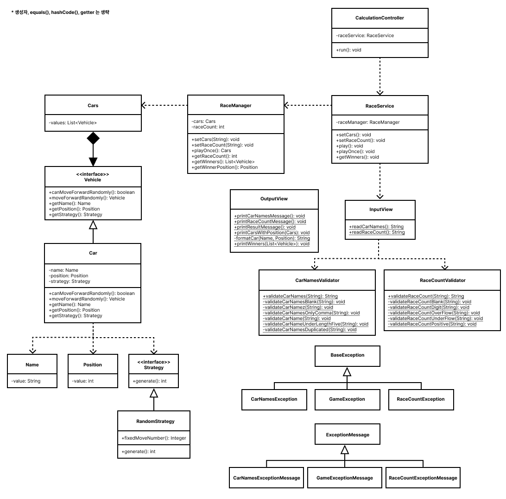

    

# 프리코스 2주차 미션 - 자동차 경주

---

> 우아한테크코스 7기 2주차 미션, 자동차 경주를 구현한 저장소입니다.

 
 

### 실행 예시

 
 

### 구현할 기능

- [x] 각 자동차에 전략을 설정하여 전략에 따라 이동하도록 한다.
- [x] 각 자동차는 이동할 수 있다.
- [x] 게임을 관리하는 매니저가 존재한다.
- [x] 자동차 이름은 중복없이 5자 이하로 영어, 한글, 숫자만 허용한다.
- [x] 게임 우승자를 판단하기 위해 위치를 비교할 때 Comparable, Comparator 를 모두 사용하여 구현한다.
- [x] Comparable 는 직접 상속하여 compareTo() 를 오버라이딩한다.
- [x] Comparator 는 직접 상속하지 않고 익명 객체를 생성하여 사용한다.

### 기능 요구사항

- [x] 주어진 횟수 동안 n대의 자동차는 전진 또는 멈출 수 있다.
- [x] 각 자동차에 이름을 부여할 수 있다. 전진하는 자동차를 출력할 때 자동차 이름을 같이 출력한다.
- [x] 자동차 이름은 쉼표(,)를 기준으로 구분하며 이름은 5자 이하만 가능하다.
- [x] 사용자는 몇 번의 이동을 할 것인지를 입력할 수 있어야 한다. (게임 횟수)
- [x] 전진하는 조건은 0에서 9 사이에서 무작위 값을 구한 후 무작위 값이 4 이상일 경우이다.
- [x] 자동차 경주 게임을 완료한 후 누가 우승했는지를 알려준다. 우승자는 한 명 이상일 수 있다.
- [x] 우승자가 여러 명일 경우 쉼표(,)를 이용하여 구분한다.
- [x] 사용자가 잘못된 값을 입력할 경우 IllegalArgumentException을 발생시킨 후 애플리케이션은 종료되어야 한다.

### 비기능 요구사항

- [x] 도메인마다 적절한 핵심 비즈니스 로직을 갖도록 구현한다. (관심사의 분리)
- [x] indent depth 는 최대 2까지 허용한다.
- [x] 3항 연산자를 사용하지 않는다.
- [x] 하나의 메서드는 하나의 역할만을 수행해야 한다.
- [x] 자동차는 랜덤한 수에 따라 이동하지만 이를 테스트할 수 있어야 한다.
- [x] setter 를 사용하지 않는다.
- [ ] DTO 를 사용한다.
- [x] Stream API를 사용한다.
- [x] 기능 단위로 커밋한다.
- [x] 단위 테스트를 작성한다.

 
 

### 클래스 다이어그램

 
 

 
 

### 미션을 수행하며 기록한 블로그 포스팅

- <a href="https://velog.io/@chan7in/%EC%9A%B0%ED%85%8C%EC%BD%94-BE-7%EA%B8%B0-%ED%9A%8C%EA%B3%A0-PRE-2-%EC%9E%90%EB%8F%99%EC%B0%A8-%EA%B2%BD%EC%A3%BC-Comparable-Comparator">
  Comparable, Comparator</a>

