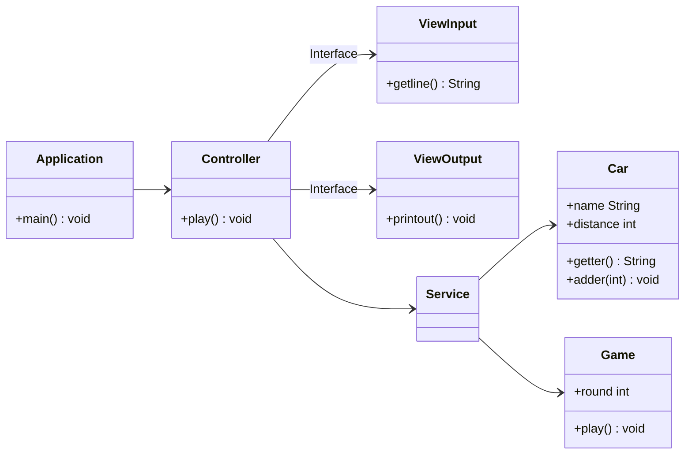

# 2주차 미션 : 자동차 경주

<details>
	<summary>과제 세부 내용</summary>

## 과제

자동차 경주 게임을 구현한다. 
- 주어진 횟수 동안 n대의 자동차는 전진 또는 멈출 수 있다.
- 각 자동차에 이름을 부여할 수 있다. 전진하는 자동차를 출력할 때 자동차 이름을 같이 출력한다.
- 자동차 이름은 쉼표(,)를 기준으로 구분하며 이름은 5자 이하만 가능하다.
- 사용자는 몇 번의 이동을 할 것인지를 입력할 수 있어야 한다.
- 전진하는 조건은 0에서 9 사이에서 무작위 값을 구한 후 무작위 값이 4 이상일 경우이다.
- 자동차 경주 게임을 완료한 후 누가 우승했는지를 알려준다. 우승자는 한 명 이상일 수 있다.
- 우승자가 여러 명일 경우 쉼표(,)를 이용하여 구분한다.
- 사용자가 잘못된 값을 입력할 경우 `IllegalArgumentException`을 발생시킨 후 애플리케이션은 종료되어야 한다.

### 입출력

- 입력
	- 경주할 자동차 이름 목록 (이름은 쉼표 (,) 기준으로 구분)
	- 시도할 횟수
- 출력
	- 차수별 실행 결과
	- 우승자 안내 문구

ex)

```
경주할 자동차 이름을 입력하세요.(이름은 쉼표(,) 기준으로 구분)
pobi,woni,jun 시도할 횟수는 몇 회인가요?
5
실행 결과
pobi : -
woni :
jun : -

pobi : --
woni : -
jun : -- 

pobi : --- 
woni : --
jun : ---

pobi : ----
woni : ---
jun : ----

pobi : -----
woni : ----
jun : -----

최종 우승자 : pobi, jun
```

</details>

## Business Logic
1. 자동차의 이름과 게임의 시도 횟수(round)를 입력받는다
2. 시도할 횟수만큼, 사용자 만큼 다음 과정을 반복한다
	- 각 참가자가 랜덤하게 이동한다
	- 각 참가자가 자신의 거리를 출력한다
3. 최종 우승자를 결정한다. 
---
## 구현할 기능 목록
### 사용자 인터페이스
- [ ] 사용자로부터 입력(int/String)을 받는다
- [ ] 문자열을 터미널에 출력한다. 

### 자동차 (Model)
- [ ] 확률적으로 이동한다. 
- [ ] 속성(이름, 이동거리)를 출력한다. 

### 게임 (Model)
- [ ] 라운드마다 자동차를 움직이고 출력한다. 
- [ ] 우승자를 판별한다. 

### 유효성 검사
- [ ] 입력의 부적절성을 검사한다
- [ ] 문자열을 다듬는다

### 예외 처리
- [ ] 기본적인 입력 예외 (타입 불일치, int overflow)
- [ ] 부적절한 입력 리스트 예외 (빈 배열)

### 리팩토링
- [ ] ...

## 클래스 다이어그램


