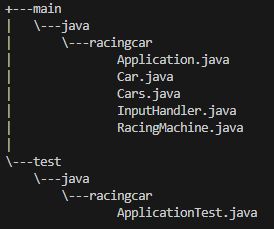
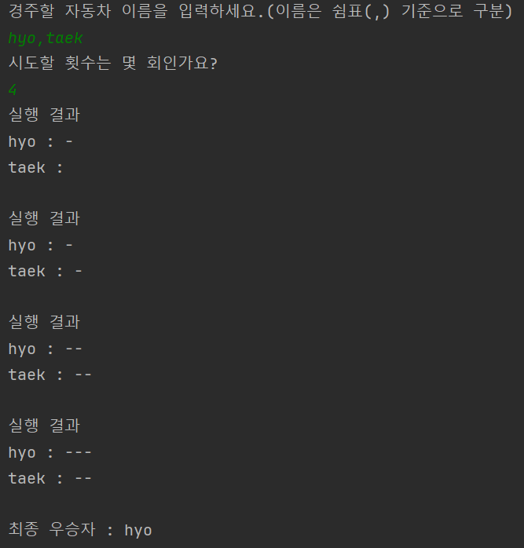

# java-racingcar-precourse

--- 
> 패키지 구조
<p align="center">
    
</p>

## 제약 조건
1. 길이 5초과 문자열 불가능
2. 이름, 쉼표 이외의 입력 불가능
3. 구분하기 어려운 이름(중복되는 이름, 공백만 있는 이름) 불가능
4. 시도 횟수는 int 범위 안의 자연수만 가능

## 기능 구현 목록
1. 레이싱 머신 초기화
2. 레이싱 게임

## 입출력
> 입력 : 
1. 길이 5 이하의 문자열과 쉼표 로 구성된 문자열
2. 시도할 횟수 N번
> 예시
```
name1,name2
10
```
```
1, \s
3
```

> 출력 : 

1. N번의 실행 결과
2. 우승자

```
실행 결과
1 : -
 \s : -

1 : --
 \s : --

1 : ---
 \s : --

최종 우승자 : 1
```

---

## 실행 결과 예시
<p align="center">
    
</p>
