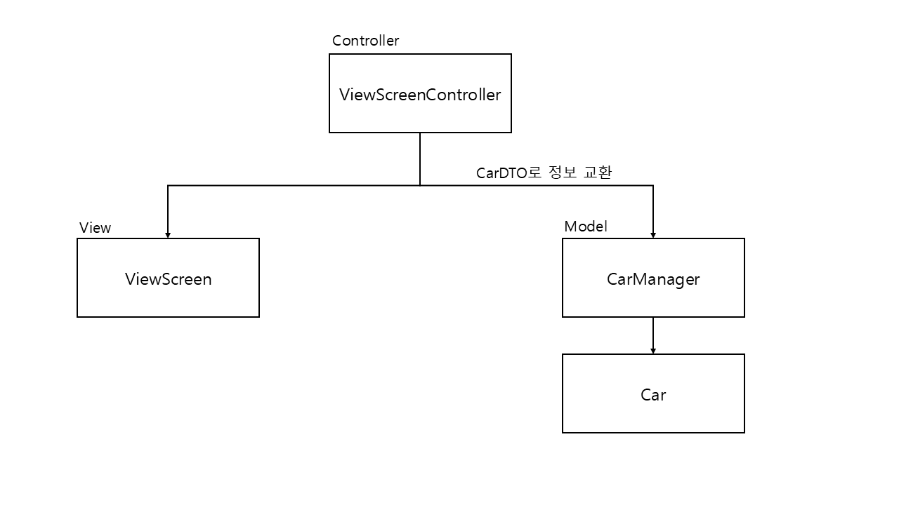

# java-racingcar-precourse

## class diagram

## 기능 정리

MVC 모델을 적용하고자 시도해뵈 위해 MVC별 기능을 정리해보려 한다.

### View (ViewScreen Class)

- 초기 입력 받기
- 경주 진행 화면 보여주기
- 우승자 보여주기

### Controller (ViewScreenController Class)

- 다양한 입출력 에러 처리
- Model에게 View 정보 전달
- View에게 Model 결과 전달
- 전체 과정 진행

### Model (Game Manager Class & Car Class)

#### Car Class

- 전진 할지말지 결정 및 저장

#### GameManager Class

- 자동차 리스트 생성
- 횟수만큼 경주 중 전진 진행
- 우승자 결정
- ~~다양한 에러 처리~~ (Controller로부터 보증된 정보만 전달 받아서 에러 처리가 필요 없엉짐)

## 제약조건 정리

- 시도 횟수는 int 범위의 양수로 제한됨
- 무조건 1번 이상의 경주를 해야함(입력 시, 횟수를 1 이상으로 입력해야함)
- 횟수는 int 범위로만 제한
- 입력 중간중간 공백을 허용함
- 자동차 이름은 영어(대문자, 소문자)와 한글만 허용