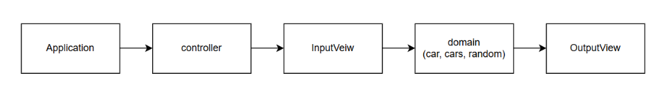

# java-racingcar-precourse



## **Application.java**  
  - 애플리케이션 실행 진입점으로, `GameController`를 생성하고 게임을 시작합니다.

## **controller/GameController.java**  
  - 게임의 흐름(Controller)을 담당하는 클래스입니다.
  - 사용자로부터 입력을 받으면(`InputView`), 이를 통해 `Cars`를 생성하고 `RandomNumberGenerator`를 통해 전진 여부를 결정합니다.
  - 게임 종료 후 `OutputView`를 통해 결과(우승자 등)를 출력합니다.
  - 핵심 로직은 `domain` 패키지에 위임하여, 컨트롤러는 흐름 제어에만 집중합니다.

## **domain/Car.java**  
  - 개별 자동차를 표현하는 도메인 클래스입니다.
  - 자동차의 이름과 위치(전진 횟수)를 관리하며, 전진 로직을 제공할 수 있습니다.

## **domain/Cars.java**  
  - 여러 자동차(`Car`)를 관리하는 도메인 클래스입니다.
  - 자동차들의 전진 로직을 일괄적으로 처리하고, 우승자를 결정하는 등의 비즈니스 로직을 담당합니다.

## **domain/RandomNumberGenerator.java**  
  - 자동차 전진 여부를 결정하기 위한 랜덤 값을 생성합니다.
  - 주어진 규칙(예: 0~9 사이의 값)으로 랜덤 값을 반환하여 자동차 전진을 판단하는 로직에 활용합니다.

## **view/InputView.java**  
  - 사용자 입력을 처리하는 뷰 클래스입니다.
  - 자동차 이름들(쉼표로 구분)과 시도 횟수를 입력받아 `GameController`로 전달합니다.

## **view/OutputView.java**  
  - 게임 결과를 출력하는 뷰 클래스입니다.
  - 각 라운드별 자동차의 이동 상태, 최종 우승자(들)를 콘솔에 출력합니다.

# 실행 방법

1. `Application.java`를 실행합니다.
2. 콘솔에 안내에 따라 자동차 이름(쉼표로 구분)과 시도 횟수를 입력합니다.
3. 각 라운드별 결과와 최종 우승자가 출력됩니다.

# Package 구조
```

📦java
 ┗ 📂racingcar
 ┃ ┣ 📂controller
 ┃ ┃ ┗ 📜GameController.java
 ┃ ┣ 📂domain
 ┃ ┃ ┣ 📜Car.java
 ┃ ┃ ┣ 📜Cars.java
 ┃ ┃ ┗ 📜RandomNumberGenerator.java
 ┃ ┣ 📂view
 ┃ ┃ ┣ 📜InputView.java
 ┃ ┃ ┗ 📜OutputView.java
 ┃ ┗ 📜Application.java

 ```