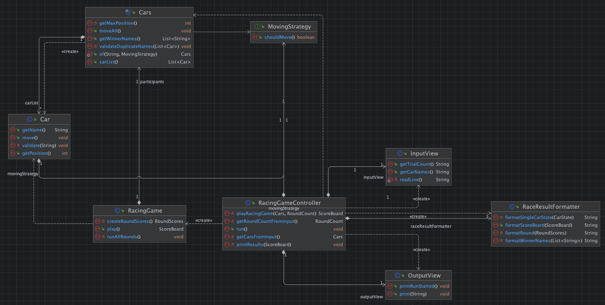

# 1. 클래스 다이어그램

이 어플리케이션은 콘솔을 통해 사용자로부터 자동차 이름과 경주 횟수를 입력받고, 각 자동차가 매 라운드마다 **랜덤 값(0~9)** 에 따라 이동하여 최종 우승자를 결정하는 경주 게임입니다.

어플리케이션 흐름은 다음과 같습니다.

1. 게임 초기화:

- 컨트롤러가 자동차 이름과 라운드 수를 사용자로부터 입력받습니다.
- 입력값을 바탕으로 자동차들을 생성합니다.

2. 게임 실행:

- 컨트롤러가 게임 도메인을 호출하여 게임을 실행합니다.
- 각 라운드마다 자동차들은 이동 전략에 따라 움직입니다.
- 모든 라운드가 끝난 후 게임은 자동차들의 이름과 위치를 담은 **점수판**을 생성합니다.

3. 결과 처리:

- 컨트롤러가 점수판을 통해 최종 결과를 가져옵니다.
- 점수판의 결과를 문자열로 바꿉니다.
- 레이싱 과정 및 결과가 사용자에게 출력됩니다.

---

# 2. 도메인 별 요구사항 정리

### 자동차 (Car)

1. 행동

- [x] 자동차는 이동 전략(MovingStrategy) 의 movable() 메서드가 true 면 움직인다.
- [x] 자동차 이름 길이는 5 이하여야 한다.

2. 상태

- [x] 자동차는 이름을 가진다.
- [x] 자동차는 위치를 가진다.

---

### 이동 전략 (MovingStrategy)

- [x] 이동 전략은 movable() 추상 메서드를 가진다.
- [x] 구현체로는 랜덤값에 따라 움직이는 RandomMovingStrategy 를 가진다.

### Cars 일급 컬렉션

1. 행동

- [x] Cars 객체는 자동차의 이름을 통해서 초기화 될 수 있다.
  - [x] 자동차의 이름이 입력되면, 쉼표를 통해서 N 개의 이름을 구분한다 (Ex : "pobi,json" == {pobi,json})
- [x] Cars 는 소유한 모든 자동차를 움직인다.
- [x] 소유한 자동차들의 이름이 중복되는 지 여부를 판별한다.
- [x] Cars 는 우승자(어떤 차가 제일 먼 위치에 있는지)들을 선정한다.
- [x] Cars 는 우승자들의 이름을 리턴한다

2. 상태
- [x] Cars 객체는 자동차(Car) 컬렉션을 가진다.

### 레이싱게임

1. 행동

- [x] Round 만큼 Cars 를 움직인다.
- [x] 레이싱게임은 레이싱게임을 실행 한 후, 점수판인 ScoreBoard 를 리턴한다.

2. 상태
- [x] 레이싱게임은 실행 횟수를 뜻하는 RoundCount 를 가진다
- [x] 레이싱게임은 점수를 기록하는 ScoreBoard 를 가진다.
- [x] 레이싱게임은 게임에서 사용되는 자동차 컬렉션인 Cars 를 가진다.

---

# 3. 입출력 요구사항 정리

- [x] 이름 입력 전 "경주할 자동차 이름을 입력하세요.(이름은 쉼표(,) 기준으로 구분)" 라는 문구가 출력된다
- [x] 사용자는 자동차(들)의 이름을 입력한다.
- [x] ~~자동차의 이름이 입력되면, 쉼표를 통해서 N 개의 이름을 구분한다 (Ex : "pobi,json" == {pobi,json})~~
- [x] 이동 횟수 입력 전 "시도할 횟수는 몇 회인가요?" 라는 문구가 출력된다
- [x] 레이싱 결과 출력 전에 "실행 결과" 라는 문구가 출력된다
- [x] 레이싱 결과 데이터를 받아서 출력용 String 으로 바꾼다.
- [x] 레이싱 결과를 출력 할 수 있다. 출력 전엔 개행 ("\n") 한다.
- [x] 자동차 이름은 공백이어도 무방하다. (따라서 공백을 없애지 않는다)
- [x] 우승자 발표는 "최종 우승자 : pobi, jun" 와 같은 형식을 띈다.
- [x] 우승자 발표 전에는 개행 ("\n") 이 있어야 한다.
- [x] 레이싱 게임 실행 결과로 받은 ScoreBoard 의 데이터를 String 으로 바꾸어 리턴한다
