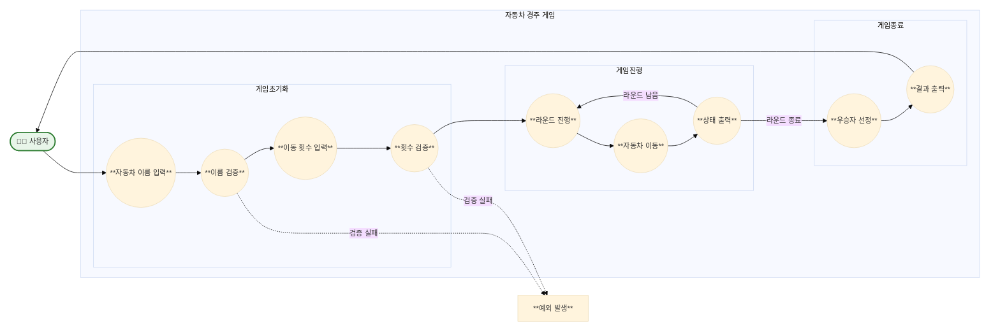

# 🚗 미션 - 자동차 경주

사용자가 입력한 자동차들로 **간단한 경주 게임을 진행**하는 프로그램을 구현한다.  
자동차들은 무작위로 전진하며, 가장 멀리 이동한 자동차가 우승한다.  
<br/>

## 🎯 사용자 Usecase

1. 사용자는 경주에 참여할 자동차들의 이름을 입력한다.
2. 사용자는 경주를 진행할 횟수를 입력한다.
3. 사용자는 각 라운드마다 자동차들의 이동 상황을 확인한다.
4. 사용자는 경주가 끝난 후 우승자를 확인한다.
5. 사용자는 잘못된 입력을 했을 때 예외를 받는다.

<br/>

## ✨ 기능 구현 목록



### 1. 게임 초기화

- 자동차 이름 입력 받기
    - 안내 문구 출력: `경주할 자동차 이름을 입력하세요.(이름은 쉼표(,) 기준으로 구분)`
    - 사용자 입력값 검증
        - 이름은 쉼표(,)로 구분하여 분리
        - 각 이름은 trim() 처리
        - 구분된 이름들에 대한 유효성 검사
            - 구분된 이름이 하나 이상인지 확인 (이름이 하나인 경우에도 경주 수행)
            - 이름이 중복되는 경우는 별도 처리하지 않음 (입력 순서로 판별 가능)
        - 각 이름에 대한 유효성 검사
            - 이름이 비어있지 않은지 확인
            - 이름이 5자 이하인지 확인
        - 검증 실패 시 `IllegalArgumentException` 발생
    - 입출력 예시:
        ```
        경주할 자동차 이름을 입력하세요.(이름은 쉼표(,) 기준으로 구분)
        pobi,woni,jun
        ```

- 이동 횟수 입력 받기
    - 안내 문구 출력: `시도할 횟수는 몇 회인가요?`
    - 사용자 입력값 검증
        - 입력값이 숫자인지 확인
        - 입력값이 0 이상인 정수인지 확인
            - 입력값이 0인 경우에도 가능 (모든 참가자가 우승)
        - 검증 실패 시 `IllegalArgumentException` 발생
    - 입출력 예시:
        ```
        시도할 횟수는 몇 회인가요?
        5
        ```

### 2. 게임 진행

- 라운드 진행
    - 실행 결과 헤더 출력: `실행 결과`
    - 각 자동차별 이동 처리
        - 0-9 사이의 무작위 값 생성
        - 값이 4 이상인 경우 전진
        - 값이 3 이하인 경우 멈춤
    - 각 자동차의 현재 상태 출력
        - 형식: `[자동차이름] : [이동거리(-)]`
        - 예시: `pobi : --`
    - 출력 예시:
        ```
        실행 결과
        pobi : -
        woni : 
        jun : -

        pobi : --
        woni : -
        jun : --

        pobi : ---
        woni : --
        jun : ---
        ```

### 3. 게임 종료

- 우승자 선정
    - 가장 멀리 이동한 자동차(들) 선별
    - 우승자 출력
        - 단독 우승 시: `최종 우승자 : [이름]`
        - 공동 우승 시: `최종 우승자 : [이름1], [이름2]`
    - 출력 예시:
        ```
        최종 우승자 : pobi, jun
        ```

<br/>

## 🔍 비기능적 요구사항

> 비기능적 요구사항도 자체 테스트를 통해 검증하도록 한다.

* indent(인덴트, 들여쓰기) depth를 3이 넘지 않도록 구현한다. 2까지만 허용한다.
    * 예를 들어 while문 안에 if문이 있으면 들여쓰기는 2이다.
    * 힌트: indent(인덴트, 들여쓰기) depth를 줄이는 좋은 방법은 함수(또는 메서드)를 분리하면 된다.
* 3항 연산자를 쓰지 않는다.
* 함수(또는 메서드)가 한 가지 일만 하도록 최대한 작게 만들어라.
* JUnit 5와 AssertJ를 이용하여 정리한 기능 목록이 정상적으로 작동하는지 테스트 코드로 확인한다.

<br/>

## 📐 구현 내용

<table>
    <tr>
        <th align="center">Package</th>
        <th align="center">Class</th>
        <th align="center">Description</th>
    </tr>
    <tr>
        <td rowspan="3"><b>controller</b></td>
        <td><b>RacingController</b></td>
        <td>게임의 전체적인 흐름을 제어하는 메인 컨트롤러</td>
    </tr>
    <tr>
        <td><b>NumberParser</b></td>
        <td>라운드 수 입력을 파싱하는 컨트롤러 유틸리티</td>
    </tr>
    <tr>
        <td><b>StringSplitter</b></td>
        <td>자동차 이름 입력을 파싱하는 컨트롤러 유틸리티</td>
    </tr>
    <tr><td colspan="3"></td></tr>
    <tr>
        <td rowspan="5"><b>domain</b></td>
        <td><b>Car</b></td>
        <td>자동차의 이름과 위치를 관리하는 도메인 객체</td>
    </tr>
    <tr>
        <td><b>Cars</b></td>
        <td>자동차들의 컬렉션을 관리하는 일급 컬렉션</td>
    </tr>
    <tr>
        <td><b>Race</b></td>
        <td>경주 진행을 관리하는 핵심 도메인 객체</td>
    </tr>
    <tr>
        <td><b>RaceHistory</b></td>
        <td>경주 기록을 관리하는 일급 컬렉션</td>
    </tr>
    <tr>
        <td><b>RoundProgress</b></td>
        <td>라운드 진행 상태를 관리하는 도메인 객체</td>
    </tr>
    <tr><td colspan="3"></td></tr>
    <tr>
        <td rowspan="4"><b>dto</b></td>
        <td><b>CarPositionDto</b></td>
        <td>단일 자동차의 위치 정보를 전달하는 DTO</td>
    </tr>
    <tr>
        <td><b>CarsPositionDto</b></td>
        <td>전체 자동차들의 위치 정보를 전달하는 DTO</td>
    </tr>
    <tr>
        <td><b>RaceResult</b></td>
        <td>경주 전체 결과를 전달하는 DTO</td>
    </tr>
    <tr>
        <td><b>WinnerNamesDto</b></td>
        <td>우승자 이름 목록을 전달하는 DTO</td>
    </tr>
    <tr><td colspan="3"></td></tr>
    <tr>
        <td rowspan="2"><b>strategy</b></td>
        <td><b>MovingStrategy</b></td>
        <td>자동차 이동 전략을 정의하는 인터페이스</td>
    </tr>
    <tr>
        <td><b>RandomMovingStrategy</b></td>
        <td>무작위 이동 전략을 구현하는 구현체</td>
    </tr>
    <tr><td colspan="3"></td></tr>
    <tr>
        <td rowspan="4"><b>vo</b></td>
        <td><b>Name</b></td>
        <td>자동차 이름을 표현하는 값 객체</td>
    </tr>
    <tr>
        <td><b>Position</b></td>
        <td>자동차 위치를 표현하는 값 객체</td>
    </tr>
    <tr>
        <td><b>Round</b></td>
        <td>라운드 수를 표현하는 값 객체</td>
    </tr>
    <tr>
        <td><b>CarsPositionSnapshot</b></td>
        <td>특정 시점의 자동차들 위치를 표현하는 값 객체</td>
    </tr>
    <tr><td colspan="3"></td></tr>
    <tr>
        <td rowspan="2"><b>view</b></td>
        <td><b>InputView</b></td>
        <td>사용자 입력을 처리하는 View 클래스</td>
    </tr>
    <tr>
        <td><b>OutputView</b></td>
        <td>게임 결과를 출력하는 View 클래스</td>
    </tr>
    <tr><td colspan="3"></td></tr>
    <tr>
        <td><b>service</b></td>
        <td><b>RacingService</b></td>
        <td>경주 생성과 실행을 관리하는 서비스 클래스</td>
    </tr>
    <tr><td colspan="3"></td></tr>
    <tr>
        <td><b>constant</b></td>
        <td><b>ExceptionMessage</b></td>
        <td>예외 메시지를 정의하는 열거형 상수</td>
    </tr>
    <tr><td colspan="3"></td></tr>
    <tr>
      <td rowspan="2"><b>util</b></td>
      <td><b>EnhancedList</b></td>
      <td>List 인터페이스를 확장하여 최대값 검색 기능을 추가로 제공하는 데코레이터 클래스</td>
    </tr>
</table>

### 1️⃣ 도메인 객체 설계

도메인 계층은 자동차 경주의 핵심 비즈니스 로직을 담당하는 객체들로 구성되어 있습니다. 각 도메인 객체는 특정 책임을 가지고 있으며, 값 객체(VO)를 통해 불변성과 유효성을 보장합니다.

**Race** 객체는 경주 전체를 관리하는 Aggregate Root입니다. 이는 Cars와 RoundProgress를 조율하여 게임의 진행을 관리합니다. Race는 Factory Method를 통해 생성되며,
생성 시점에 모든 초기화가 완료됩니다.

**Cars**는 일급 컬렉션으로서 자동차들의 컬렉션을 관리합니다. 단순한 List 이상의 의미를 가지며, 자동차들의 이동과 우승자 선정 등 컬렉션에 관한 모든 책임을 캡슐화합니다. 이를 통해 컬렉션 조작에 대한
응집도를 높이고 불변성을 보장합니다.

### 2️⃣ 값 객체(Value Object) 활용

도메인의 개념을 더 명확하게 표현하고 유효성을 보장하기 위해 값 객체를 적극 활용했습니다:

- **Name**: 자동차 이름을 표현하며, 5자 이하 제한 등의 규칙을 캡슐화
- **Position**: 자동차의 위치를 표현하며, 움직임에 따른 상태 변화를 관리
- **Round**: 라운드 수를 표현하며, 유효한 범위 검증을 담당
- **CarsPositionSnapshot**: 특정 시점의 자동차들 위치를 불변 객체로 표현

이러한 값 객체들은 `equals()`와 `hashCode()`를 구현하여 값의 동등성을 보장하며, 생성 시점에 모든 유효성 검증을 수행합니다.

### 3️⃣ 전략 패턴 적용

자동차의 이동 로직은 전략 패턴을 통해 구현되었습니다. `MovingStrategy` 인터페이스를 통해 이동 전략을 추상화하고, `RandomMovingStrategy`가 실제 구현을 담당합니다.

이러한 설계의 장점은:

1. 다양한 이동 전략을 쉽게 추가할 수 있음
2. 테스트시 가짜 전략으로 대체 가능
3. 이동 로직의 변경이 다른 코드에 영향을 주지 않음

### 4️⃣ 기록 관리와 스냅샷 패턴

게임의 진행 상황을 추적하기 위해 `RaceHistory`라는 일급 컬렉션과 `CarsPositionSnapshot` 값 객체를 활용했습니다. 각 라운드의 상태는 스냅샷으로 저장되어 불변성을 보장하며, 이는 게임
결과 조회와 우승자 판정에 활용됩니다.

이러한 방식의 이점:

- 각 라운드의 상태가 명확하게 보존됨
- 상태 변경이 다른 라운드에 영향을 주지 않음
- 게임 진행 과정을 추적하기 용이함

### 5️⃣ DTO를 통한 계층 분리

도메인 객체와 뷰 계층 사이의 결합도를 낮추기 위해 DTO를 활용했습니다. 모든 DTO는 record로 구현되어 불변성을 보장하며, 도메인 객체의 내부 구현을 외부에 노출하지 않습니다.

- **CarPositionDto**: 단일 자동차의 상태 전달
- **CarsPositionDto**: 전체 자동차들의 상태 전달
- **RaceResult**: 경주 전체 결과 전달
- **WinnerNamesDto**: 우승자 정보 전달

이를 통해 도메인 로직의 변경이 뷰 계층에 영향을 주지 않도록 보장합니다.

### 6️⃣ 유틸리티 클래스 구현

**EnhancedList 데코레이터**  
List 인터페이스를 확장하여 추가 기능을 제공하는 데코레이터 패턴을 구현했습니다:

1. **디자인 패턴**
    - 데코레이터 패턴을 사용하여 기존 List 구현체의 기능을 확장
    - 제네릭을 활용하여 Comparable 인터페이스 구현체만 허용

2. **주요 기능**
    - maxAll(): 리스트에서 최대값과 동일한 모든 요소를 찾는 기능
    - List 인터페이스의 모든 기본 기능 위임

3. **안전성 보장**
    - null 체크와 빈 리스트 검증
    - 불변성을 고려한 방어적 복사
    - 명확한 예외 처리

### 7️⃣ 아키텍처 테스트 구현

> test/java/racingcar/architecture 참고

프로젝트의 코드 품질을 보장하기 위해 자체 아키텍처 테스트 프레임워크를 구현했습니다:

1. **CodeStyleAnalyzer**
    - 들여쓰기 깊이 검사 (최대 2)
    - 삼항 연산자 사용 감지
    - 메서드 길이 제한 (최대 15줄)

2. **빌더 패턴 활용**

```java
CodeStyleAnalyzer analyzer = new CodeStyleAnalyzer()
        .checkIndentDepth(2)
        .checkTernaryOperator()
        .checkMethodSize(15);
```
