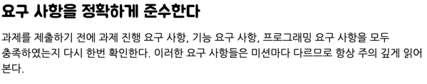

# 1주 차 미션 회고

## 간단한 소감

---
1주 차를 한 단어로 표현하면 “설렘”이라고표현하고 싶습니다.

처음으로 제 코드가 많은 사람에게 보이는 기회를 가질 수 있었습니다.  그렇기에, 코드를 구현하는 내내 잘 구현해야 한다는 압박감과 떨림이 있었지만, 설렘이 더 앞섰습니다.

한 번은 식당에서 노트북을 폈습니다. 제가 짠 코드에서 startWith() 함수를 써서 메서드를 간소화하고 가독성을 더 좋게 만들 수 있는 방법이 떠올랐습니다. 공부하는 티를 너무 내는 것 같아서 뻘쭘했지만, 시간이 지나면 까먹을 것 같았습니다. 그만큼 미션에 몰두하며 일주일을 보냈던 것 같습니다.

또한, 당장 시험 기간이기 때문에 학교 공부에 시간을 어느 정도 할애해야 했습니다. 그렇기에 쉬는 시간을 포함하여 학교에 있는 시간은 학교 공부에 시간을 투자하고, 나머지는 모두 미션에 투자하는 간단한 루틴을 만들었습니다. 하지만 쉬는 시간에도, 조금씩 비는 시간에도 모두 미션만 했습니다. 지금 생각해 보면 루틴에 관계없이 마음이 시키는 대로 공부했던 것 같습니다.

## 좋았던 점은 무엇인가?

---
* **목표에 한 발짝 다가선다는 것이 좋았습니다.**

저는 프로그래밍 자체가 재미있고, 최종적으로 오류 없는 서비스를 제공하는 것이 제 목표입니다.

1주 차 미션이 끝나고, 제공받은 테스트 자료들과 피드백 영상, 글을 읽으며 자바 뿐만 아니라 프로그래머로서의 역량이 상승할 것이라는 것이 느껴졌습니다. 
때문에, 프리코스에 참여한 것 만으로도 제 목표를 향해 나아가고 있다는 것이 느껴졌고, 꼭 우아한테크코스에 붙고싶다는 욕심이 생겼습니다.

* **부족하다는 것을 느끼다.**

미션이 끝나고, 다른 사람들의 코드를 보며 감탄이 나올 정도로 잘하시는 분들이 많다는 것을 느꼈습니다.

프리코스라는 좋은 기회에 참여하여, 제가 부족하다는 것을 다시금 되새길 수 있는 기회였습니다.
강한 동기부여가 되었고, 이렇게 잘하시는 분들이 디스코드 채널에 좋은 자료를 공유해주시는 기회를 놓치지 않고 열심히 학습할 것입니다.

## 아쉬웠던 점은 무엇인가?

---
* **요구사항을 제대로 지키지 않았습니다.**

1주 차 미션 요구사항에 빈 문자열이 들어오는 경우에 0을 반환하라고 되어있었습니다.
하지만 저는 빈 문자열이 들어오는 경우를 예외처리 하였고, 제대로된 요구사항을 지키지 못했습니다.

위 사진과 같이, 1주 차 미션 피드백에도 요구사항을 잘 지키라고 나와있습니다.
구현에만 몰두하느라, 다른 요소들을 중요하게 생각하지 못한 것이 아쉽습니다. 

* **정확한 책임을 나누자**

해당 부분은 문자열 계산기 피드백 영상과 코드리뷰를 보며 아쉽다고 느낀 사항입니다.

저는 계산기 미션을 진행할 때, 계산기가 문자열을 입력 받아서 필드에 저장을 하고, 각 메서드를 통해 결과를 도출하는 방식으로 코드를 작성하였습니다.

그러나 피드백 영상을 보며 느낀 점은 계산기는 더하고 빼주는 역할만 하면 된다는 것입니다. 
따라서, 영상에서 static 메서드를 사용하여 Calculator.add() 이런 식으로 "계산에만 중점"을 두어 로직을 작성하는 것을 통해, 문제를 잘 파악하여 해당 클래스가 올바른 책임만 가지도록 구현해야 한다는 것을 느꼈습니다.
정확한 책임을 나누지 않고 코드를 작성한 점이 정말 아쉽게 느껴집니다.

* **의미를 나타내는 네이밍을 하자**

메서드의 경우 컨벤션을 지키며, 동사를 통해 올바른 네이밍을 하였습니다. 하지만 상수 처리를 할 때, 그렇지 못했다는 것을 파악하였습니다.

한 예로 sum = 0 의 경우, 0을 INITIAL_NUMBER 라는 네이밍을 하였습니다. 이 경우에 INITIAL_NUMBER 라는 네이밍이 가지고 있는 의미를 잘 파악하지 못할 것이라는 느낌이 들었습니다.
INITIALIZE_ADD_NUMBER 나 INITIAL_SUM 과 같은 방식으로 나타내면 훨씬 이해하기 편할 것 같았습니다.

이번 2주 차 미션부터는 네이밍을 통해 의미를 파악할 수 있도록 올바른 네이밍을 사용할 것입니다.

## 무엇을 배웠는가?

---
* **문서화의 중요성**

1주 차 목표는 “꼼꼼한 문서화”였습니다.

처음 미션을 확인했을 때, 구현 차제는 엄청 어렵다고 느껴지지 않았습니다. 그렇기에, 구현과 동시에 제가 하는 모든 변경 사항을 문서로 남기며 문서화 부분에도 시간 투자를 하고자 하였습니다. 과제 진행 요구 사항에 “README.md 기능 구현 목록을 정리해 추가한다.”라는 요구 사항도 있었기에 이를 목표로 잡았습니다.

학습 내용을 문서로 정리하며, 한 번 더 내용을 체계적으로 정리하고 머릿속에 남길 수 있었습니다. 이번 미션에서는 깃 메시지 컨벤션과 Java Style Guide를 정리하여 블로그에 공유하면서, 기록이 타인과 지식을 나누는 데 큰 도움이 된다는 것을 깨달았습니다. 이를 통해 문서화가 개인 학습을 넘어, 다른 사람과 함께 성장할 수 첫걸음이라는 것을 깨닫게 되었습니다.

또한, 코드 수정 시 문제를 분석하고 해결 과정을 문서로 기록하며 문제 해결 능력을 키웠습니다. 문제점을 정확히 파악하고 분석하다 보니 해결책이 자연스럽게 떠올랐고, 문서로 기록된 수정 과정을 통해 다음에 비슷한 문제가 발생했을 때 유용한 참고 자료가 되었습니다. 문서화는 단순히 기록이 아닌, 문제 해결의 중요한 도구임을 실감하게 되었습니다.

* **GIt**

과제 진행 요구 사항에 “Git의 커밋 단위는 기능 목록 단위로 추가한다.”라는 요구 사항이 있었습니다.  이 요구 사항을 충실히 따르며 프로젝트를 진행하는 과정에서, Git을 다루는 방식에 대한 새로운 시각을 얻게 되었습니다.

[scope]

제가 깃 메시지 컨벤션을 익히면서 가장 마음에 들었던 부분은 단연 scope였습니다. 이전에는 "Feat: ~~"처럼, 제대로 된 컨벤션을 신경 쓰지 않고 커밋 메시지를 작성했었습니다. 이 방식으로는 나중에 커밋 목록만 보고 변경된 부분을 정확히 파악하기 어려워, 결국 body를 읽거나 변경된 파일을 직접 열어 확인하는 번거로움이 따랐습니다. 하지만 이번에 AngularJS의 커밋 메시지 컨벤션을 학습하며 scope를 도입한 후, 커밋 관리가 완전히 달라졌습니다.

커밋 목록만 봐도 각 수정이 어떤 모듈이나 계층에 영향을 미쳤는지 명확히 파악할 수 있었고, 작업의 흐름이 더 잘 드러났습니다. 단순히 코드를 저장하는 것이 아니라, 전체 프로젝트 구조와 기능이 어떻게 구성되고 변경되었는지를 직관적으로 보여주는 도구로 Git을 활용하게 되었습니다.

[문서 변경 시 커밋은 어떻게 찍어야 하나]

미션을 진행하면서 가장 고민이 되었던 부분 중 하나는 "문서 변경 시 커밋을 어떻게 찍어야 할까"라는 것이었습니다. 과제 요구 사항에는 기능 목록 단위로 커밋을 추가하라고 명시되어 있었지만, 문서를 먼저 추가하고 이후에 기능을 구현하는 것이 맞지 않을까 하는 생각이 들었습니다.

이 고민을 해결하기 위해 구글링을 하면서, 이전 우테코 프리코스 피드백을 접하게 되었습니다. 그 피드백 중에서 인상 깊었던 내용은 "살아있는 문서를 만들어라"라는 말이었습니다. 이 피드백을 통해, 문서도 코드처럼 지속적으로 업데이트되고 유지 보수되는 요소라는 사실을  깨달았습니다.

초기에 기능 목록을 작성한 문서나 따로 공부한 내용을 기록한 경우는, docs라는 커밋 메시지로 문서만 따로 구분하여 커밋에 추가했습니다. 이후에 변경되거나 추가되는 기능 목록의 경우는, 실제로 구현한 기능과 문서를 함께 업데이트하면서 "살아있는 문서"를 유지했습니다. 이렇게 하면 커밋 로그를 통해 문서와 코드가 함께 발전하는 과정을 명확하게 추적할 수 있었기에, 해당 방식으로 커밋을 추가하였습니다.

* **Java**

이번 미션에서는 누군가에게 보여지는 코드를 짜는 만큼, 가독성 좋은 코드를 작성하고자 하였습니다.

[자바 컨벤션을 익히다]

자바 코드 작성 시 지켜야 할 규칙들을 더 깊이 이해하기 위해, 자바 컨벤션을 익히는 데 시간을 투자했습니다. 특히 변수와 메서드의 네이밍, 클래스 구조, 그리고 코드 블록의 배치와 같은 컨벤션을 학습하며, 왜 이러한 규칙들이 존재하는지 명확히 이해하게 되었습니다. 이전에는 코드가 동작하는 것에만 중점을 두었다면, 이번 미션을 통해 가독성과 유지 보수성을 동시에 고려한 코드를 작성하는 법을 배웠습니다. 하지만 아직도 Javadoc에 해당되는 컨벤션은 익숙하지 않고, 적용해 보지 못했습니다. 따라서, 수시로 정독하며 Javadoc 컨벤션과 그 외의 익히지 못한 컨벤션을 익힐 것입니다.

[테스트 코드의 가독성을 높이다]

테스트 코드를 작성하면서 "관심사를 묶는 것이 어떨까?"라는 생각이 들었습니다. 테스트에서도 관련된 기능을 그룹화하면 코드 구조가 더 명확해지고, 각 테스트의 목적을 쉽게 파악할 수 있을 것이라고 생각했습니다.

그 이유는 단순히 코드의 구조를 명확하게 만드는 것에 그치지 않았습니다. 테스트 네이밍을 "기본_구분자로_문자열을_분리한다"와 같이 작성했을 때, 그 테스트가 정상 동작을 검증하는 것인지, 예외적인 상황을 다루는 것인지 명확하지 않다고 느꼈습니다. 이 문제를 해결하기 위해, 각 테스트가 어떤 맥락에서 실행되는지 더 명확하게 표현하고자 @Nested 어노테이션을 학습하여 사용하였습니다.

그리고 실제로, @Nested 어노테이션을 사용하여 관련된 테스트들을 그룹화한 덕분에, 각 테스트가 어떤 상황을 테스트하는지 직관적으로 파악할 수 있게 되었고, 정상 동작과 예외 상황을 명확히 구분할 수 있었습니다.

[외부 라이브러리]

camp.nextstep.edu.missionutils 라이브러리와 그 안에 포함된 NsTest 클래스를 사용하면서, 외부 도구가 얼마나 개발을 쉽게 해주고 효율성을 높일 수 있는지를 체감할 수 있었습니다.

프로그램을 구현한 뒤, 전체적인 테스트를 어떻게 구성할지 고민하던 중, 기본적으로 제공된 Application 테스트 코드가 NsTest를 상속받고 있다는 것을 알게 되었습니다. NsTest에 대해 살펴본 결과, 입출력을 통해 결과를 캡처하여 테스트를 진행하는 클래스임을 알게 되었습니다. 이를 이용하여 테스트 코드를 구현했고, 출력 결과를 쉽게 검증할 수 있었습니다.

이번 미션은 외부 라이브러리를 처음으로 자세히 살펴보고 실제로 적용해 본 경험이었습니다. 이를 통해 외부 라이브러리가 개발 과정에서 얼마나 효율성을 높일 수 있는지, 그리고 코드 작성 시간을 크게 단축시킬 수 있는지를 깨달았습니다. 하지만 동시에, 외부 라이브러리를 올바르게 사용하려면 그 도구의 내부 로직을 충분히 이해하는 것이 중요하다는 사실도 느꼈습니다.
