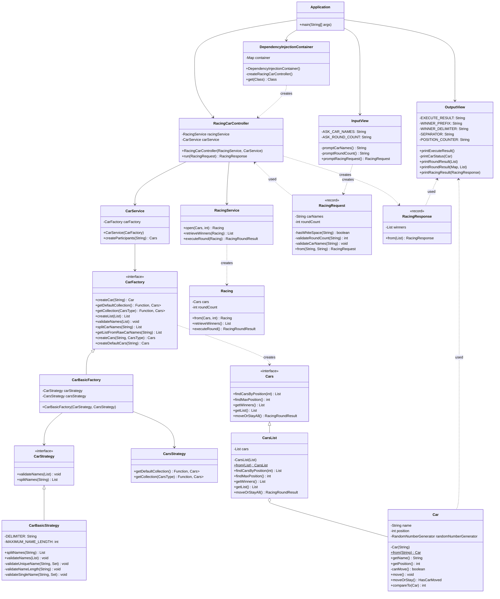

```mermaid
 classDiagram
    class CarStrategy {
        <<interface>>
        +validateNames(List<String>) void
        +splitNames(String) List<String>
    }
    class CarBasicStrategy {
        -DELIMITER: String
        -MAXIMUM_NAME_LENGTH: int
        +splitNames(String) List<String>
        +validateNames(List<String>) void
        -validateUniqueName(String, Set<String>) void
        -validateNameLength(String) void
        -validateSingleName(String, Set<String>) void
    }
    class CarsStrategy {
        +getDefaultCollection() Function<List<Car>, Cars>
        +getCollection(CarsType) Function<List<Car>, Cars>
    }
    class CarFactory {
        <<interface>>
        +createCar(String) Car
        +getDefaultCollection() Function<List<Car>, Cars>
        +getCollection(CarsType) Function<List<Car>, Cars>
        +createList(List<String>) List<Car>
        +validateNames(List<String>) void
        +splitCarNames(String) List<String>
        +getListFromRawCarNames(String) List<Car>
        +createCars(String, CarsType) Cars
        +createDefaultCars(String) Cars
    }
    class CarBasicFactory {
        -CarStrategy carStrategy
        -CarsStrategy carsStrategy
        +CarBasicFactory(CarStrategy, CarsStrategy)
    }

    class RacingService {
        +open(Cars, int) Racing
        +retrieveWinners(Racing) List<Car>
        +executeRound(Racing) RacingRoundResult
    }
    class Racing {
        -Cars cars
        -int roundCount
        +from(Cars, int) Racing
        +retrieveWinners() List<Car>
        +executeRound() RacingRoundResult
    }
    class CarService {
        -CarFactory carFactory
        +CarService(CarFactory)
        +createParticipants(String) Cars
    }
    class Car {
        -String name
        -int position
        -RandomNumberGenerator randomNumberGenerator
        -Car(String)
        +from(String) Car$
        +getName() String
        +getPosition() int
        -canMove() boolean
        +move() void
        +moveOrStay() HasCarMoved
        +compareTo(Car) int
    }
    class Cars {
        <<interface>>
        +findCarsByPosition(int) List<Car>
        +findMaxPosition() int
        +getWinners() List<Car>
        +getList() List<Car>
        +moveOrStayAll() RacingRoundResult
    }
    class CarsList {
        -List<Car> cars
        -CarsList(List<Car>)
        +from(List<Car>) CarsList$
        +findCarsByPosition(int) List<Car>
        +findMaxPosition() int
        +getWinners() List<Car>
        +getList() List<Car>
        +moveOrStayAll() RacingRoundResult
    }
    class RacingCarController {
        -RacingService racingService
        -CarService carService
        +RacingCarController(RacingService, CarService)
        +run(RacingRequest) RacingResponse
    }
    class DependencyInjectionContainer {
        -Map container
        +DependencyInjectionContainer()
        -createRacingCarController()
        +get(Class) Class
    }
    class InputView {
        -ASK_CAR_NAMES: String
        -ASK_ROUND_COUNT: String
        -promptCarNames() String
        -promptRoundCount() String
        +promptRacingRequest() RacingRequest
    }
    
    class RacingRequest {
        <<record>>
        -String carNames
        -int roundCount
        -hasWhiteSpace(String) boolean
        -validateRoundCount(String) int
        -validateCarNames(String) void
        +from(String, String) RacingRequest
    }
    
    class OutputView {
        -EXECUTE_RESULT: String
        -WINNER_PREFIX: String
        -WINNER_DELIMITER: String
        -SEPARATOR: String
        -POSITION_COUNTER: String
        +printExecuteResult()
        -printCarStatus(Car)
        +printRoundResult(List<Car>)
        +printRoundResult(Map<String, Car>, List<String>)
        +printRacingResult(RacingResponse)
    }
    class RacingResponse {
        <<record>>
        -List<String> winners
        +from(List<Car>) RacingResponse
    }
    class Application {
        +main(String[] args)
    }
    Application --> InputView
    Application --> DependencyInjectionContainer
    Application --> RacingCarController
    Application --> OutputView
    DependencyInjectionContainer ..> RacingCarController : creates
    CarStrategy <|-- CarBasicStrategy
    CarFactory <|-- CarBasicFactory
    CarBasicFactory --> CarStrategy
    CarBasicFactory --> CarsStrategy
    CarService --> CarFactory
    RacingCarController --> RacingService
    RacingCarController --> CarService
    RacingCarController <.. RacingRequest : used
    RacingCarController ..> RacingResponse : creates
    InputView ..> RacingRequest : creates
    CarFactory ..> Cars : creates
    RacingService ..> Racing : creates
    Cars <|-- CarsList
    CarsList o-- Car
    OutputView <.. Car : used
    OutputView <.. RacingResponse : used
```