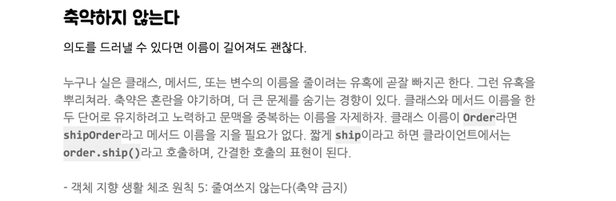

# 객체 지향 생활 체조 원칙

### 학습하게 된 이유

---

* 1주 차 피드백을 샅샅히 보다보니, "축약하지 않는다" 밑에 객체 지향 생활 체조 원칙이 있었습니다. 
그래서 객체 지향 생활 체조 원칙에 대해 찾아보니, 정말 좋은 내용들이 많았습니다.

### 객체 지향 생활 체조 원칙이란 무엇인가?

---

객체 지향 생활 체조 원칙은 소트웍스 앤솔러지에서 다루고 있는 내용으로 객체 지향 프로그래밍을 잘하기 위한 9가지 원칙이라고 합니다.

한국에서는 우테코 교장선생님이신 박재성님이 해당 내용으로 강연도 하시더라고요. 그래서 저도 찾아보며 조금 봤습니다 ㅋㅋ 밑에 링크 남겨놓았으니, 참고하시면 좋을 것 같아요.

### 1. 한 메서드에 오직 한 단계의 들여쓰기만 한다.

---
* 메서드 내에서 여러 단계로 중첩된 조건문이나 반복문을 사용하지 않도록 권장합니다. 한 단계 이상의 들여쓰기가 필요할 경우, 메서드를 분리하면 해결이 가능합니다.

**예시**

기존
~~~
public int add(int a, int b) {
    if (a > 0) {         // 1단계 들여쓰기
        if (b > 0) {     // 2단계 들여쓰기 (이 원칙을 위반)
            return a + b;
        }
    }
    return 0;
}
~~~

변경
~~~
public int add(int a, int b) {
    if (!isPositive(a) || !isPositive(b)) {
        return 0;
    }
    return a + b;
}

private boolean isPositive(int num) {
    return num > 0;
}
~~~

### 2. ``else`` 예약여를 사용하지 않는다.

---
* else 구문이 있을 경우, 의도를 파악하기 어렵고 리팩터링에 어려움이 있을 수 있습니다.

**예시**

기존
~~~
public int divide(int a, int b) {
    if (b == 0) {
        return 0;
    } else {
        return a / b;
    }
}
~~~

변경
~~~
public int divide(int a, int b) {
    if (b == 0) {
        return 0;
    }
    return a / b;
}

~~~

### 3. 모든 원시 값과 문자열을 포장한다.

---
* 모든 문자열과 원시 값을 객체로 포장하여, 의미를 명확하게 나타내고 값과 관련된 로직을 처리할 수 있습니다.

**예시**

기존
~~~
int a; // a 가 무엇을 나타내는지 알 수 없음
~~~

변경
~~~
public class Number {
    private int value;

    public Number(int value) {
        this.value = value;
    }
}

Number number = new Number(a); //Number로 포장해서 사용
~~~

### 4. 일급 컬렉션을 사용한다.

---
* 컬렉션을 직접 사용하는 대신, 감싸는 클래스를 만들어 일관되게 관리합니다.

**예시**

기존
~~~
public class Calculator {
    private List<Integer> numbers;
    ~
    ~
    ~
}
~~~

변경
~~~
public class Calculator {
    private List<Number> numbers;
    ~
    ~
    ~
}
~~~

### 5. 한 줄에 점을 하나만 찍는다.

---
* 멤버 변수에 접근하기 위한 점을 의미합니다. 디미터 법칙을 준수하여, 코드 간의 의존성을 낮추어 유지보수성을 높입니다.

**예시**

기존
~~~
public void calculate(Calculator calculator) {
    System.out.println(calculator.getNumbers().get(0).getValue());
}
~~~

변경
~~~
public void calculate(Calculator calculator) {
    Number firstNumber = calculator.getFirstNumber();
    System.out.println(firstNumber.getValue());
}
~~~

### 6. 줄여 쓰지 않는다(축약 금지).

---
* 변수명이나 메서드명은 직관적으로 명확하게 작성하여, 코드를 읽는 사람이 쉽게 이해할 수 있도록 합니다.

**예시**

기존
~~~
int calcSum = calculator.calculateSum();
~~~

변경
~~~
int calculatedSum = calculator.calculateSum();
~~~

### 7. 모든 엔티티를 작게 유지한다.

---
* 클래스와 메서드는 간결하고 작게 유지하여 하나의 역할만 담당하도록 합니다.

클래스마다 책임을 명확하게 하여 단일 책임 원칙(Single Responsibility Principle)을 따르게 하고, 이로 인해 클래스를 작게 유지하는 것이 중요합니다.

작고 단순한 클래스와 메서드를 유지함으로써, 각 객체가 독립적으로 설계되어 다른 객체와의 결합도가 낮아지고 코드의 유연성은 높아집니다.

### 8. 3개 이상의 인스턴스 변수를 가진 클래스를 만들지 않는다.

---
* 인스턴스 변수를 최소화하여 클래스의 책임을 단순하게 유지하고, 복잡성을 줄입니다.

**예시**

기존
~~~
public class Calculator {
    private int a;
    private int b;
    private int c;
    private int d; // 4개 이상의 인스턴스 변수 (이 원칙을 위반)
}
~~~

변경
~~~
public class Calculator {
    private Number firstOperand;
    private Number secondOperand;
}
~~~

### 9. Getter/Setter/프로퍼티를 사용하지 않는다.

---
* 데이터 캡슐화를 유지하고 외부에서 객체의 데이터를 직접 조작하지 않도록 합니다.

**예시**

기존
~~~
public class Number {
    private int value;

    public int getValue() {
        return value;
    }
}
~~~

변경
~~~
public class Number {
    private int value;

    public Number add(Number other) {
        return new Number(this.value + other.value);
    }
}
~~~

---
Ref) https://www.youtube.com/watch?v=bIeqAlmNRrA, https://devwooks.tistory.com/59
